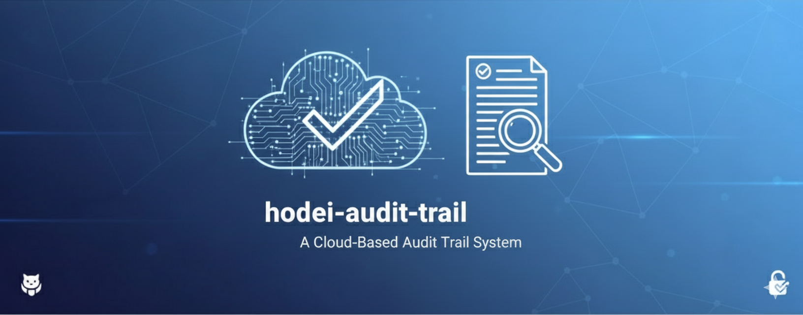

<div align="center">



# Hodei Audit Trail

[](https://github.com/rubentxu/hodei-trail/actions/workflows/ci.yml)
[](https://codecov.io/gh/rubentxu/hodei-trail)
[](https://www.rust-lang.org/)
[](LICENSE)
[](https://discord.gg/hodei-audit)

Un sistema centralizado de logging de auditoría multi-tenant para aplicaciones empresariales. Construido con Rust, con aislamiento seguro de tenants, cumplimiento GDPR y escalabilidad de nivel empresarial.

[Características](#-características) • [Inicio Rápido](#-inicio-rápido) • [Documentación](#-documentación) • [Arquitectura](#-arquitectura) • [Contribuir](#-contribuir)

</div>

---

## 📖 ¿Qué es Hodei Audit Trail?

**Hodei Audit Trail** es un sistema de logging de auditoría centralizado de grado productivo, diseñado para entornos empresariales. Proporciona capacidades integrales de auditoría con **aislamiento multi-tenant completo**, **cumplimiento GDPR** y **procesamiento de eventos de alto rendimiento**.

Construido usando el patrón **CAP/ARP** (Centralized Audit Point / Audit Reporting Point) con integración **Vector.dev**, Hodei ofrece gestión de auditoría segura, compliant y escalable para aplicaciones modernas.

### ¿Por qué Hodei?

✅ **Aislamiento Multi-Tenant Completo** - Seguridad a nivel de fila con cero acceso entre tenants  
✅ **Cumplimiento GDPR** - Retención automatizada y derecho al olvido  
✅ **Seguridad Empresarial** - Hashing de API keys SHA-256, detección de abuso y rate limiting  
✅ **Alto Rendimiento** - 10,000+ eventos/segundo con < 1ms de sobrecarga en SDK  
✅ **Integración 1-Línea** - Añadir logging de auditoría con una sola línea de código  
✅ **Compatible con CloudTrail** - Sigue patrones y taxonomías de AWS CloudTrail  
✅ **Integración Vector.dev** - Arquitectura simplificada de ingesta y fan-out  

---

## 🚀 Características

### Seguridad Multi-Tenant
- **Row-Level Security (RLS)**: Aislamiento a nivel de base de datos en ClickHouse
- **Gestión de API Keys**: Hashing SHA-256 con scopes granulares (Read, Write, Crypto, Admin, Monitoring)
- **Cuotas de Recursos**: Cuotas basadas en niveles (Enterprise, SME, Startup) con detección de abuso
- **Contexto de Tenant**: Almacenamiento local de hilo con trace IDs y seguimiento de spans

### Cumplimiento GDPR
- **Retención Automatizada**: Políticas de retención configurables por nivel
  - Enterprise: 7 años
  - SME: 1-5 años (configurable)
  - Startup: 1 año
- **Suspensiones Legales**: Protección de datos durante litigios
- **Derecho al Olvido**: Eliminación automatizada con traza de auditoría completa
- **Acceso/Portabilidad de Datos**: Soporte completo de derechos GDPR

### Sistema HRN
- **Nombres de Recursos Jerárquicos**: Identificación canónica de recursos
- **Formato**: `hrn:partition:service:tenant:region:type/path`
- **Ejemplos**:
  - `hrn:hodei:verified-permissions:tenant-123:global:policy-store/default`
  - `hrn:hodei:api:tenant-123:global:user/create`

### Integración SDK
- **Middleware Axum**: Integración de 1 línea
- **Procesamiento por Lotes**: Políticas de tamaño/tiempo/híbrido con manejo de contrapresión
- **Auto-enriquecimiento**: Generación de HRN y extracción de metadatos
- **Pool de Conexiones**: Gestión de conexiones gRPC con lógica de reintento

### Arquitectura de Almacenamiento
- **Almacenamiento por Niveles**: Caliente (ClickHouse), Templado (S3), Frío (Glacier)
- **ClickHouse**: Nivel caliente para eventos recientes (< 30 días)
- **S3/MinIO**: Niveles templado/frío con compresión Parquet
- **Vector.dev**: Ingesta unificada y fan-out a múltiples sinks

---

## 🏗️ Arquitectura

### Patrón CAP/ARP

```
┌─────────────────────────────────────────────────────────────┐
│                 Hodei Audit Service (CAP)                   │
│                                                              │
│  ┌─────────────┐  ┌─────────────┐  ┌─────────────┐         │
│  │    gRPC     │  │   Almacén   │  │   Crypto    │         │
│  │  Servicios  │  │  Backends   │  │   Worker    │         │
│  │  :50052-54  │  │ ClickHouse  │  │ Digest/HMAC │         │
│  └─────────────┘  │      S3     │  └─────────────┘         │
│         │         └─────────────┘            │              │
│         │                                      │            │
│         ▼                                      ▼            │
│  ┌──────────────────────────────────────────────────┐      │
│  │         Capa de Seguridad Multi-Tenant           │      │
│  │  • Row-Level Security (RLS)                      │      │
│  │  • Gestión de API Keys                           │      │
│  │  • Cuotas de Recursos y Rate Limiting            │      │
│  │  • Cumplimiento GDPR                             │      │
│  └──────────────────────────────────────────────────┘      │
└─────────────────────────────────────────────────────────────┘
         │                                    │
         │ gRPC :50052                        │ gRPC :50051
         ▼                                    ▼
┌─────────────────┐                    ┌──────────────┐
│ Aplicaciones    │                    │ Vector.dev   │
│   (Axum SDK)    │                    │   Ingestor   │
│   (ARP Layer)   │                    │   Fan-out    │
└─────────────────┘                    └──────────────┘
                                              │
                                              ▼
                              ┌─────────────────────────────┐
                              │      Niveles de Almacén      │
                              │  Caliente: ClickHouse        │
                              │  Templado: S3                │
                              │  Frío: Glacier               │
                              └─────────────────────────────┘
```

### Capas de Aislamiento Multi-Tenant

1. **Contexto de Tenant**: Almacenamiento local de hilo con tenant_id, api_key, user_id, trace_id
2. **Interceptores gRPC**: Validación de requests y extracción de contexto
3. **Gestión de API Keys**: Hashing SHA-256 con scopes granulares
4. **Row-Level Security**: Filtrado de tenants a nivel de base de datos
5. **Cuotas de Recursos**: Rate limiting basado en niveles y detección de abuso
6. **Cumplimiento GDPR**: Retención y eliminación automatizadas

---

## ⚡ Inicio Rápido

### Prerrequisitos

- Rust 1.75+
- Docker y Docker Compose
- Just (opcional, para task runner)

### Instalación

```bash
# Clonar el repositorio
git clone https://github.com/rubentxu/hodei-trail.git
cd hodei-trail

# Instalar dependencias
cargo install just cargo-watch
rustup target add x86_64-unknown-linux-musl

# Configurar entorno de desarrollo
just setup
# o
./scripts/setup-dev.sh
```

### Ejecutar con Docker

```bash
# Iniciar todos los servicios (ClickHouse, Vector, MinIO, Prometheus)
docker-compose -f docker-compose.dev.yml up -d

# Iniciar el servicio de auditoría
cargo run -p hodei-audit-service
```

### Ejemplo de Integración SDK

Añadir a tu `Cargo.toml`:

```toml
[dependencies]
hodei-audit-sdk = "0.1"
axum = "0.8"
tokio = { version = "1.0", features = ["full"] }
```

En tu aplicación:

```rust
use hodei_audit_sdk::{AuditSdkConfig, AuditLayer};
use axum::{Router, routing::get};

#[tokio::main]
async fn main() -> Result<(), Box<dyn std::error::Error>> {
    // Integración de 1 línea
    let app = Router::new()
        .route("/api/*path", get(handler))
        .layer(
            AuditSdkConfig::builder()
                .service_name("mi-servicio")
                .tenant_id("tenant-123")
                .audit_service_url("http://audit-service:50052")
                .batch_size(100)
                .batch_timeout(std::time::Duration::from_millis(100))
                .build()?
                .layer()
        );

    axum::Server::bind(&"0.0.0.0:3000".parse()?)
        .serve(app.into_make_service())
        .await?;

    Ok(())
}
```

**¡Eso es todo!** El SDK capturará automáticamente todas las requests HTTP, generará HRNs y enviará eventos de auditoría.

---

## 📊 Rendimiento

| Métrica | Valor |
|---------|-------|
| **Rendimiento** | 10,000+ eventos/segundo |
| **Latencia SDK** | < 1ms de sobrecarga |
| **Eficiencia de Almacenamiento** | Compresión Parquet (gzip/brotli/zstd) |
| **Uso de Memoria** | < 10MB base |
| **Reducción de Red** | 99% (procesamiento por lotes) |

---

## 🧪 Pruebas

```bash
# Ejecutar todas las pruebas
cargo test --workspace

# Ejecutar suites de pruebas específicas
cargo test -p hodei-audit-service tenant
cargo test -p hodei-audit-service quotas
cargo test -p hodei-audit-service api_key
cargo test -p hodei-audit-service compliance
cargo test -p hodei-audit-service row_level_security
cargo test -p hodei-audit-sdk

# Generar reporte de cobertura
cargo tarpaulin --workspace --out html --output-dir coverage/

# Abrir reporte de cobertura
open coverage/tarpaulin-report.html
```

**Estado Actual de Pruebas**: 121 pruebas pasando ✅ (100% tasa de éxito)

---

## 📦 Estructura del Proyecto

```
hodei-trail/
├── Cargo.toml                    # Raíz del workspace
├── justfile                      # Task runner
├── .env.example                  # Plantilla de variables de entorno
├── docker-compose.dev.yml        # Servicios de desarrollo
│
├── hodei-audit-proto/            # Definiciones de protocolo gRPC
│   ├── proto/
│   │   ├── audit_event.proto
│   │   ├── audit_control.proto
│   │   ├── audit_query.proto
│   │   ├── audit_crypto.proto
│   │   └── vector_api.proto
│   └── src/lib.rs
│
├── hodei-audit-types/            # Tipos compartidos
│   └── src/
│       ├── lib.rs
│       └── hrn.rs                # HRN (Hodei Resource Names)
│
├── hodei-audit-service/          # Servicio principal (CAP)
│   ├── src/
│   │   ├── main.rs
│   │   ├── lib.rs
│   │   ├── grpc/                 # servicios gRPC
│   │   │   ├── audit_control_server.rs
│   │   │   ├── audit_query_server.rs
│   │   │   ├── audit_crypto_server.rs
│   │   │   └── vector_api_server.rs
│   │   ├── storage/              # backends de almacenamiento
│   │   │   ├── clickhouse.rs
│   │   │   └── s3_storage.rs
│   │   ├── tenant.rs             # gestión multi-tenant
│   │   ├── api_key.rs            # API keys y rate limiting
│   │   ├── quotas.rs             # cuotas de recursos
│   │   ├── compliance.rs         # cumplimiento GDPR
│   │   ├── row_level_security.rs # RLS de base de datos
│   │   ├── grpc_interceptor.rs   # interceptores gRPC
│   │   ├── hrn.rs                # utilidades HRN
│   │   ├── query.rs              # motor de consultas
│   │   ├── service.rs            # lógica de negocio
│   │   └── tests/                # pruebas de integración
│   │       ├── tenant_isolation_test.rs
│   │       └── e2e_multitenancy_test.rs
│   │
├── hodei-audit-sdk/              # SDK cliente (ARP)
│   ├── src/
│   │   ├── lib.rs
│   │   ├── client.rs             # cliente gRPC
│   │   ├── batch.rs              # procesamiento por lotes
│   │   ├── middleware.rs         # middleware Axum
│   │   ├── hrn.rs                # utilidades HRN
│   │   └── types.rs              # tipos del SDK
│   ├── README.md
│   └── INTEGRATION-VERIFIED-PERMISSIONS.md
│
└── docs/                         # Documentación
    ├── architecture/             # ADRs y documentos de arquitectura
    ├── api/                      # documentación de API
    ├── epic-*.md                 # planes de implementación
    └── assets/
        └── banner-hodei-audit-trail.png
```

---

## 🛠️ Desarrollo

### Tareas Comunes

```bash
# Compilar
just build
# o
cargo build --workspace

# Ejecutar servicio
cargo run -p hodei-audit-service

# Formatear código
just fmt
# o
cargo fmt --all

# Lint
just lint
# o
cargo clippy --all-targets --all-features

# Ejecutar pruebas
just test
# o
cargo test --workspace --all-targets

# Ejecutar pruebas de integración
./hodei-audit-service/run_integration_tests.sh

# Generar documentación
just docs
# o
cargo doc --workspace --no-deps

# Limpiar artefactos de compilación
just clean
```

### Añadir una Nueva Característica

1. **Crear branch de características**:
   ```bash
   git checkout -b feat/mi-caracteristica
   ```

2. **Escribir pruebas primero** (enfoque TDD)

3. **Implementar la característica**

4. **Asegurar que todas las pruebas pasan**:
   ```bash
   cargo test --workspace
   ```

5. **Formatear código**:
   ```bash
   cargo fmt --all
   ```

6. **Linting**:
   ```bash
   cargo clippy --all-targets --all-features
   ```

7. **Commit** (seguir Conventional Commits):
   ```bash
   git commit -m "feat(scope): añadir mi caracteristica"
   ```

8. **Crear PR** para revisión

### Estándares de Commits

Todos los commits siguen **Conventional Commits**:

```
<tipo>(<scope>): <descripción>

feat(epic5): completar implementación multi-tenant y seguridad
fix(clickhouse): resolver fuga de pool de conexiones
docs(readme): actualizar instrucciones de instalación
test(tenant): añadir prueba de aislamiento RLS
```

**Tipos**: feat, fix, docs, test, refactor, chore, perf, ci

---

## 📚 Documentación

### Documentación Clave

- **[Reporte de Finalización Epic 5](EPIC5_COMPLETION_REPORT.md)** - Detalles completos de implementación de Epic 5
- **[README del SDK](hodei-audit-sdk/README.md)** - Guía de uso del SDK y ejemplos
- **[Integración Verified Permissions](hodei-audit-sdk/INTEGRATION-VERIFIED-PERMISSIONS.md)** - Guía de integración
- **[Documentación de Arquitectura](docs/architecture/)** - ADRs y documentos de diseño
- **[Planes de Epics](docs/)** - Hoja de ruta de implementación (10 epics)
- **[Contratos gRPC](docs/api/grpc-contracts.md)** - Documentación de API

### Generar Documentación

```bash
# Generar documentación de Rust
just docs

# Servir localmente
just docs-serve

# Verificar enlaces de documentación
markdown-link-check docs/**/*.md
```

---

## 🔒 Seguridad

### Características de Seguridad

- **Hashing de API Keys**: SHA-256 (keys nunca almacenadas en texto plano)
- **Aislamiento de Tenants**: Aislamiento multi-tenant completo con RLS
- **Detección de Abuso**: Monitoreo en tiempo real (>1000 requests/minuto)
- **Rate Limiting**: Algoritmo token bucket por API key
- **Cumplimiento GDPR**: Retención automatizada y derecho al olvido
- **Traza de Auditoría**: Traza completa de todas las operaciones

### Auditoría de Seguridad

```bash
# Ejecutar auditoría de seguridad
cargo audit

# Corregir vulnerabilidades
cargo audit --fix
```

---

## 🌐 Hoja de Ruta de Epics

**Estado Actual**: Epic 5 (Multi-Tenancy) ✅ COMPLETADO

| Epic | Estado | Descripción |
|------|--------|-------------|
| 1 | ✅ | Fundación y Arquitectura |
| 2 | ✅ | Servicio Core y Sistema HRN |
| 3 | ✅ | SDK Middleware e Integración |
| 4 | ✅ | Backend de Almacenamiento y ClickHouse |
| 5 | ✅ | Multi-Tenancy y Seguridad |
| 6 | ⏳ | Digest Criptográfico y Cumplimiento |
| 7 | ⏳ | Alto Rendimiento y Escalabilidad |
| 8 | ⏳ | Vector.dev y Persistencia Avanzada |
| 9 | ⏳ | Observabilidad y Métricas |
| 10 | ⏳ | DevOps y Despliegue |

**Objetivo**: 23-30 semanas en total (6-7 meses)

---

## 🤝 Contribuir

¡Damos la bienvenida a contribuciones! Por favor consulta nuestra [Guía de Contribución](CONTRIBUTING.md) para detalles.

### Proceso de Desarrollo

1. Fork del repositorio
2. Crear un branch de características
3. Escribir pruebas para tus cambios
4. Asegurar que todas las pruebas pasan
5. Enviar un pull request

### Estándares de Código

- Seguir convenciones de nomenclatura de Rust
- Escribir pruebas comprensivas
- Documentar APIs públicas con KDoc
- Asegurar 0 warnings de clippy
- Seguir Conventional Commits

### Lista de Verificación de Pull Request

- [ ] Pruebas añadidas/actualizadas y pasando
- [ ] Código formateado con `cargo fmt`
- [ ] Linting limpio (`cargo clippy`)
- [ ] Documentación actualizada
- [ ] Commit sigue Conventional Commits
- [ ] Descripción del PR explica los cambios

---

## 📄 Licencia

Este proyecto está licenciado bajo la Licencia Apache 2.0. Ver el archivo [LICENSE](LICENSE) para detalles.

---

## 🙏 Reconocimientos

- [Tonic](https://github.com/hyperium/tonic) - Framework gRPC
- [Axum](https://github.com/tokio-rs/axum) - Framework web
- [ClickHouse](https://clickhouse.com/) - Base de datos analítica
- [Vector.dev](https://vector.dev/) - Ingesta de datos y fan-out
- [Tower](https://github.com/tower-rs/tower) - Sistema de middleware
- [Tracing](https://github.com/tokio-rs/tracing) - Observabilidad

---

## 📞 Soporte

- **Documentación**: [docs/](docs/)
- **Issues**: [GitHub Issues](https://github.com/rubentxu/hodei-trail/issues)
- **Discusiones**: [GitHub Discussions](https://github.com/rubentxu/hodei-trail/discussions)
- **Discord**: [Unirse a nuestro Discord](https://discord.gg/hodei-audit)

---

<div align="center">

**Construido con ❤️ usando Rust**

[Sitio Web](https://hodei-audit.dev) • [Documentación](docs/) • [Issues](https://github.com/rubentxu/hodei-trail/issues) • [Discusiones](https://github.com/rubentxu/hodei-trail/discussions)

</div>
