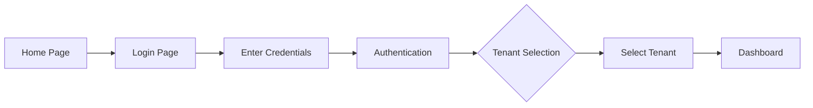

# Hodei Audit Trail - User Guide

## Table of Contents
1. [Getting Started](#getting-started)
2. [Authentication](#authentication)
3. [Dashboard](#dashboard)
4. [Event Management](#event-management)
5. [Analytics](#analytics)
6. [Compliance](#compliance)
7. [User Roles and Permissions](#user-roles-and-permissions)
8. [Keyboard Shortcuts](#keyboard-shortcuts)
9. [Troubleshooting](#troubleshooting)
10. [FAQ](#faq)

---

## Getting Started

### System Requirements
- Modern web browser (Chrome 90+, Firefox 88+, Safari 14+, Edge 90+)
- Internet connection
- Valid user credentials

### Accessing the Application
1. Open your web browser
2. Navigate to `http://localhost:3000` (development)
3. Or your organization's Hodei Audit URL (production)

When you first access the application, you'll see the **Welcome Screen**:


**URL**: `http://localhost:3000/` or `/`

This is the landing page of Hodei Audit Trail, where you can:
- View the application branding
- Access the sign-in link
- Get information about the system

---

## Authentication

### First Login - Complete Workflow

The authentication process in Hodei Audit Trail follows a **2-step process**:

1. **Step 1: Login with Credentials**
2. **Step 2: Tenant Selection**

#### Step 1: Accessing the Login Page

From the home page, click the "Sign In" link or navigate directly to `/auth/login`.

**Screenshot: Login Page**


**URL**: `/auth/login`

The login page displays:
- **Email field**: Enter your registered email address
- **Password field**: Enter your password
- **Sign In button**: Click to authenticate
- **Logo and branding**: Hodei Audit Trail identity

#### Step 2: Tenant Selection

After successful authentication, you'll be redirected to the **Tenant Selection** page if you have access to multiple tenants.

**Screenshot: Tenant Selection Page**


**URL**: `/auth/tenant`

On this page, you can:
- **Select your tenant**: Choose from available organizations
- **Confirm selection**: Click to proceed to the dashboard
- **View tenant information**: See tenant name and ID

#### Step 3: Accessing the Dashboard

Once you've selected a tenant, you'll be automatically redirected to the **Main Dashboard**.

**Screenshot: Dashboard**


### Login Process

Here's the complete login flow:



**Step-by-step instructions:**

1. **Navigate to Login**: From home page or directly to `/auth/login`
2. **Enter Email**: Type your registered email address
   ```
   Example: admin@hodei.com
   ```
3. **Enter Password**: Type your secure password
   ```
   Note: Password is masked for security
   ```
4. **Click Sign In**: Submit your credentials
5. **Select Tenant**: Choose your organization from the dropdown
6. **Confirm**: Click to access the dashboard
7. **Dashboard**: You're now logged in and can use the system

### Password Requirements
- Minimum 8 characters
- At least one uppercase letter
- At least one number
- At least one special character

### Demo Credentials (for testing)

For demonstration purposes, you can use these test accounts:

```
Email: admin@hodei.com
Password: Admin123!

Email: analyst@hodei.com
Password: Analyst123!
```

### Session Management
- **Session Duration**: 15 minutes of inactivity
- **Auto-logout**: You'll be automatically logged out after 15 minutes
- **Manual Logout**: Click your profile icon → "Sign Out"

### Account Lockout
- After 5 failed login attempts, your account will be temporarily locked
- Wait 15 minutes before trying again
- Contact your administrator if you need immediate access

---

## Dashboard

### Overview

The Dashboard is your **main hub** in Hodei Audit Trail, providing a real-time overview of your audit trail activity. After successful login and tenant selection, you'll be automatically redirected to the dashboard.

**Screenshot: Main Dashboard**


**URL**: `/` or `/dashboard`

The dashboard is divided into several key areas:

### Dashboard Components

#### 1. **Navigation Header**
Located at the top of the page, containing:
- **Hodei Audit logo**: Click to return to home
- **Navigation menu**: Access to Events, Analytics, Compliance
- **User profile**: Tenant selector, settings, logout
- **Search bar**: Quick search across events

#### 2. **Activity Summary Widget**
- **Total Events**: Count of all audit events in the system
- **Today's Events**: Events recorded in the last 24 hours
- **Critical Events**: High-priority events requiring immediate attention
- **Compliance Score**: Overall compliance percentage with your selected standards

#### 3. **Recent Activity Feed**
- Timeline of the most recent events
- Shows: Timestamp, Event Type, User, Action, Status
- Color-coded by severity:
  - 🔴 **Critical**: Red - Security breaches, unauthorized access
  - 🟡 **Warning**: Yellow - Suspicious activity, policy violations
  - 🔵 **Info**: Blue - Normal operations, system events
  - ✅ **Success**: Green - Completed actions, successful logins

#### 4. **Quick Actions Panel**
Convenient shortcuts to common tasks:
- **Create Event**: Record a new audit event
- **Run Report**: Generate a compliance report
- **Export Data**: Download event data in CSV, JSON, or PDF
- **View Analytics**: Access the analytics dashboard
- **Settings**: Configure dashboard preferences

#### 5. **System Status Panel**
Real-time system health indicators:
- **Backend Services**: Connection status to API services
- **Data Sync**: Last synchronization time with external systems
- **Database**: Health status of the audit database
- **Performance**: Current system load and response times

### Accessing the Dashboard

**Complete Flow from Login:**

1. **Login** → Enter credentials at `/auth/login`
2. **Tenant Selection** → Choose your organization
3. **Dashboard** → Automatic redirect to main dashboard (`/` or `/dashboard`)

The dashboard is the **default landing page** after authentication. You can always return to it by:
- Clicking the Hodei Audit logo in the top-left
- Clicking "Dashboard" in the navigation menu
- Navigating to the root URL `/`

### Dashboard Widgets

Each widget is designed to provide specific insights:

**Events Widget**
- View recent audit events
- Filter by date range, severity, user
- Quick actions: View Details, Export, Create New

**Compliance Widget**
- Current compliance score
- Recent policy violations
- Upcoming audit dates

**Analytics Widget**
- Event trends over time
- Top active users
- Most common event types

**System Health Widget**
- Service status indicators
- Performance metrics
- Error rates

### Customizing Your Dashboard

You can personalize the dashboard layout to match your workflow:

1. Click the **Settings** icon (⚙️) in the top right
2. Select **"Customize Dashboard"**
3. Choose which widgets to display
4. Drag and drop to reorder widgets
5. Adjust widget sizes (small, medium, large)
6. Set default filters for each widget
7. Click **"Save Layout"**

**Layout Options:**
- **Default**: Standard 2-column layout
- **Compact**: More widgets, smaller sizes
- **Wide**: Single column, full-width widgets
- **Custom**: Your personalized layout

### Real-Time Updates

The dashboard automatically refreshes every 30 seconds to show:
- New audit events
- Updated compliance scores
- System status changes
- User activity

You can manually refresh by:
- Clicking the refresh icon in the header
- Pressing `F5` on your keyboard
- Navigating away and returning

### Keyboard Shortcuts

While on the dashboard:

| Shortcut | Action |
|----------|--------|
| `Ctrl + E` | Go to Events page |
| `Ctrl + A` | Go to Analytics page |
| `Ctrl + C` | Go to Compliance page |
| `Ctrl + R` | Refresh dashboard |
| `Ctrl + Shift + D` | Toggle fullscreen mode |
| `/` | Focus search bar |
| `Esc` | Clear filters |

---

## Event Management

The **Event Management** section is where you view, create, filter, and export all audit events in the system. It's one of the most frequently used features of Hodei Audit Trail.

### Accessing Events Page

**Screenshot: Events Management Page**


**URL**: `/events`

You can access the Events page in several ways:

1. **Navigation Menu**: Click **"Events"** in the main navigation menu
2. **Keyboard Shortcut**: Press `Ctrl + E` (Windows/Linux) or `Cmd + E` (Mac)
3. **Dashboard Widget**: Click "View All Events" in the Recent Activity Feed
4. **URL**: Navigate directly to `/events`

#### Event List View
The events page displays a paginated list of all audit events with the following columns:
- **Timestamp**: When the event occurred
- **Type**: Event category (Authentication, Authorization, Data Access, etc.)
- **User**: Who performed the action
- **Resource**: What was affected
- **Status**: Success/Failure
- **Severity**: Info/Warning/Error/Critical
- **Actions**: View, Edit, Export

#### Event Details
To view full details of an event:
1. Click on any event row
2. The **Event Details Modal** will open
3. View complete information:
   - Full timestamp with timezone
   - Detailed description
   - IP address
   - User agent
   - Request/response data
   - Related events

### Creating Events

#### Manual Event Creation
1. Click **"New Event"** button (or press `Ctrl + N`)
2. Fill in the required fields:
   - **Event Type**: Select from dropdown
   - **Severity**: Info, Warning, Error, or Critical
   - **Description**: Detailed description of the event
   - **User**: User who performed the action
   - **Resource**: Affected resource
3. Click **"Create Event"**

#### Required Fields
- Event Type
- Severity
- Description
- Timestamp (defaults to now)

### Filtering and Search

#### Quick Search
- Use the **Search** box at the top to find specific events
- Search works across: event type, user, resource, description
- Press `Enter` or click the search icon

#### Advanced Filters
1. Click **"Advanced Filters"** button
2. Apply filters:
   - **Date Range**: Select start and end dates
   - **Event Type**: Multi-select dropdown
   - **Severity**: Checkbox selection
   - **User**: Type to search users
   - **Status**: Success/Failed/Both
3. Click **"Apply Filters"**
4. Click **"Clear All"** to reset

#### Saved Searches
1. After setting filters, click **"Save Search"**
2. Give your search a name
3. Access saved searches from **"My Saved Searches"**

### Exporting Events

#### Export Options
1. Select events (checkbox on left of each row)
2. Or use **"Select All"** for all visible events
3. Click **"Export"** button
4. Choose format:
   - **CSV**: For Excel/Sheets
   - **JSON**: For developers
   - **PDF**: For reports

#### Export Fields
You can choose which fields to include in the export:
- Timestamp
- Event Type
- User
- Resource
- Description
- Status
- Severity
- Custom fields

---

## Analytics

### Accessing Analytics
- Click **"Analytics"** in the main navigation
- Or use the shortcut: `Ctrl + Shift + A`

### Analytics Dashboard

**Screenshot: Analytics Dashboard**


**URL**: `/analytics`

The Analytics dashboard provides comprehensive insights into your audit trail data through interactive charts, graphs, and custom queries.

#### Available Reports

##### 1. **User Activity Analytics**
- Most active users
- User login patterns
- Failed login attempts
- Session duration

##### 2. **Event Type Distribution**
- Pie chart of event types
- Trends over time
- Comparison between periods

##### 3. **Security Analytics**
- Failed authentication attempts
- Privilege escalation attempts
- Suspicious IP addresses
- Geographic distribution

##### 4. **Compliance Metrics**
- Compliance score over time
- Policy violations
- Audit trail completeness
- Missing events

##### 5. **Performance Analytics**
- API response times
- System load
- Error rates
- Throughput

### Running Custom Queries

#### Query Builder
1. Click **"New Query"**
2. Select **"Build Query"**
3. Define:
   - **Data Source**: Events, Users, Sessions, etc.
   - **Fields**: Which fields to display
   - **Filters**: Apply conditions
   - **Group By**: Group results
   - **Time Range**: When to analyze
4. Click **"Run Query"**

#### Query Templates
Pre-built queries for common use cases:
- Security Incident Report
- User Access Review
- Compliance Audit
- Performance Analysis
- Trend Analysis

#### Saving Queries
1. After running a query, click **"Save Query"**
2. Enter a name and description
3. Set as public or private
4. Access from **"My Queries"**

### Visualizations

#### Chart Types
- **Line Charts**: Trends over time
- **Bar Charts**: Comparisons
- **Pie Charts**: Distributions
- **Heat Maps**: Intensity mapping
- **Tables**: Detailed data
- **Scatter Plots**: Correlations

#### Customization
1. Click the **Settings** icon on any chart
2. Customize:
   - Colors
   - Labels
   - Legends
   - Axes
   - Title
3. Click **"Apply"**

### Exporting Analytics
1. Click **"Export"** on any chart or table
2. Choose format:
   - **PNG**: Image for presentations
   - **PDF**: Document
   - **CSV**: Data for Excel
   - **JSON**: Raw data

---

## Compliance

### Accessing Compliance
- Click **"Compliance"** in the main navigation
- Or use the shortcut: `Ctrl + Shift + C`

### Compliance Dashboard

**Screenshot: Compliance Dashboard**


**URL**: `/compliance`

The Compliance dashboard helps you track and manage your organization's compliance with various regulatory standards and internal policies.

#### Compliance Standards
- **SOX**: Sarbanes-Oxley
- **HIPAA**: Healthcare data protection
- **GDPR**: EU data protection
- **PCI DSS**: Payment card security
- **ISO 27001**: Information security
- **Custom**: Your organization's standards

#### Key Metrics
- **Overall Compliance Score**: Percentage of compliance
- **Critical Violations**: Must-fix items
- **Policy Coverage**: Areas with policies
- **Last Audit**: Date of last compliance review
- **Next Review**: Scheduled audit date

### Compliance Reports

#### Generating Reports
1. Click **"Generate Report"**
2. Select:
   - **Standard**: Which compliance framework
   - **Date Range**: Period to analyze
   - **Scope**: What to include
   - **Format**: PDF, HTML, or Word
3. Click **"Generate"**
4. Wait for processing (can take several minutes)
5. Download when ready

#### Report Types
- **Executive Summary**: High-level overview
- **Detailed Report**: Comprehensive analysis
- **Gap Analysis**: What needs to be fixed
- **Remediation Plan**: How to fix issues
- **Audit Trail**: Complete event history

### Policy Management

#### Viewing Policies
1. Click **"Policies"**
2. Browse by:
   - Standard (SOX, HIPAA, etc.)
   - Category
   - Status (Active, Draft, Archived)
   - Last Updated

#### Policy Details
Click any policy to view:
- **Description**: What the policy requires
- **Requirements**: Specific rules
- **Evidence**: What's needed to prove compliance
- **Violations**: Current non-compliance issues
- **Remediation**: How to fix violations

#### Policy Violations
1. Click **"Violations"** tab
2. View all non-compliant items:
   - Policy name
   - Description
   - Severity
   - Date detected
   - Assigned to
   - Status
3. Filter by:
   - Severity
   - Status
   - Assigned user
   - Date range

#### Managing Violations
1. Click on a violation
2. **Assign**: Assign to a user for remediation
3. **Comment**: Add notes
4. **Update Status**:
   - Open
   - In Progress
   - Resolved
   - Accepted Risk
5. **Attach Evidence**: Upload supporting documents

### Key Management (Cryptographic)

#### Viewing Keys
1. Click **"Key Management"**
2. View all cryptographic keys:
   - Key ID
   - Algorithm
   - Status (Active, Expired, Revoked)
   - Created
   - Last Used
   - Rotation Schedule

#### Key Rotation
1. Select a key
2. Click **"Rotate Key"**
3. Confirm rotation
4. System will:
   - Generate new key
   - Update dependent systems
   - Revoke old key
   - Log the operation

### Audit Trail Verification

#### Digest Chain
1. Click **"Audit Trail"**
2. View **Digest Chain**:
   - Cryptographic chain of all events
   - Each event links to the previous
   - Tamper-evident

#### Verifying Integrity
1. Click **"Verify Integrity"**
2. System checks:
   - Digest chain integrity
   - Missing events
   - Out-of-sequence events
   - Cryptographic validation
3. View results and certificate

### Notifications

#### Setting Up Alerts
1. Click **"Notifications"**
2. Click **"New Alert"**
3. Configure:
   - **Name**: Alert name
   - **Condition**: What triggers it
   - **Severity**: Info, Warning, Critical
   - **Recipients**: Who gets notified
   - **Channels**: Email, SMS, Webhook
4. Click **"Create Alert"**

#### Alert Conditions
- Compliance score drops below threshold
- Critical policy violation
- Key expiration approaching
- Unusual activity detected
- Failed compliance check

---

## User Roles and Permissions

### Available Roles

#### 🔑 **Administrator**
Full access to all features:
- Manage users and roles
- Configure system settings
- Access all data and reports
- Manage compliance standards
- Rotate cryptographic keys

#### 👨‍💼 **Analyst**
Access to analytics and reporting:
- View all events
- Create custom queries
- Generate reports
- Export data
- Cannot manage users or system settings

#### 🔍 **Auditor**
Read-only access focused on compliance:
- View events and reports
- Access compliance dashboard
- Verify audit trail
- Export compliance reports
- Cannot modify data

#### 👁️ **Viewer**
Limited read-only access:
- View dashboard
- Read events (limited)
- Basic reports
- Cannot export or modify

### Managing Permissions

#### For Administrators:
1. Go to **"Admin"** → **"User Management"**
2. Click on a user
3. Click **"Edit Permissions"**
4. Check/uncheck permissions:
   - Event Management
   - Analytics
   - Compliance
   - Key Management
   - User Management
5. Click **"Save Changes"**

#### Requesting Permissions:
1. Click your **profile icon**
2. Select **"Request Access"**
3. Select the role or permissions needed
4. Add justification
5. Click **"Submit"**
6. Wait for administrator approval

---

## Keyboard Shortcuts

| Shortcut | Action | Context |
|----------|--------|---------|
| `Ctrl + E` | Go to Events | Global |
| `Ctrl + A` | Go to Analytics | Global |
| `Ctrl + C` | Go to Compliance | Global |
| `Ctrl + N` | New Event | Events page |
| `Ctrl + F` | Search | Global |
| `Ctrl + S` | Save | Forms |
| `Ctrl + R` | Run Query | Analytics |
| `Ctrl + P` | Export | Data pages |
| `F5` | Refresh | Global |
| `Esc` | Close Modal | Modals |
| `?` | Show Shortcuts | Global |

### Search Shortcuts
- `Ctrl + K`: Quick search
- `/`: Focus search box
- `↑/↓`: Navigate search results
- `Enter`: Select result

---

## Troubleshooting

### Common Issues

#### Issue: Can't Log In
**Symptoms**:
- Error message on login
- Redirected back to login page
- Session expires immediately

**Solutions**:
1. Check your credentials are correct
2. Clear browser cache and cookies
3. Try a different browser
4. Check if account is locked (wait 15 minutes)
5. Contact administrator

#### Issue: Page Won't Load
**Symptoms**:
- Blank page
- "Page not found" error
- Infinite loading spinner

**Solutions**:
1. Press `F5` to refresh
2. Check internet connection
3. Try a different browser
4. Clear browser cache
5. Check system status at bottom of page

#### Issue: Missing Events
**Symptoms**:
- Events you expect are not showing
- Date ranges seem incorrect

**Solutions**:
1. Check your filters (clear all filters)
2. Verify date range settings
3. Check your permissions
4. Ensure events are being recorded
5. Contact administrator

#### Issue: Slow Performance
**Symptoms**:
- Pages load slowly
- Queries take a long time
- Timeouts

**Solutions**:
1. Reduce date range for queries
2. Apply more specific filters
3. Close unused browser tabs
4. Check internet connection
5. Try during off-peak hours

#### Issue: Export Fails
**Symptoms**:
- Export button doesn't work
- File doesn't download
- Error message

**Solutions**:
1. Check you have permission to export
2. Reduce the number of records
3. Try a different export format
4. Disable browser pop-up blockers
5. Check available disk space

### Getting Help

#### In-App Help
1. Click **"?"** icon (top right)
2. Browse help topics
3. Search for specific questions

#### Contact Support
- **Email**: support@hodeaudi.com
- **Chat**: Click chat icon (if available)
- **Documentation**: Visit `/docs` in the app

#### Reporting Bugs
1. Go to **"Settings"** → **"Report Issue"**
2. Describe the problem
3. Include steps to reproduce
4. Add screenshots if helpful
5. Click **"Submit"**

---

## FAQ

### General Questions

**Q: How long is the audit trail kept?**
A: By default, 7 years, but this can be configured by administrators based on compliance requirements.

**Q: Can I recover deleted events?**
A: No, events are immutable once created. Only administrators can delete events, and this is logged.

**Q: Can I customize the dashboard?**
A: Yes, administrators can create custom dashboards for different roles.

**Q: How do I change my password?**
A: Go to **Profile** → **Security** → **Change Password**.

**Q: Can I schedule reports?**
A: Yes, you can schedule reports to be generated and emailed automatically.

### Security Questions

**Q: Is my data encrypted?**
A: Yes, all data is encrypted at rest and in transit using industry-standard encryption.

**Q: How secure is the audit trail?**
A: The audit trail uses cryptographic chaining to ensure tamper-evidence and integrity.

**Q: Who can see my data?**
A: Access is controlled by your role. Only users with appropriate permissions can view your data.

**Q: Can administrators see my password?**
A: No, passwords are hashed and cannot be decrypted, even by administrators.

### Compliance Questions

**Q: Which compliance standards does Hodei support?**
A: SOX, HIPAA, GDPR, PCI DSS, ISO 27001, and custom standards.

**Q: How do I prepare for an audit?**
A: Use the **Compliance** section to generate an audit report and verify your audit trail integrity.

**Q: Can I prove the integrity of my audit trail?**
A: Yes, use the **Audit Trail Verification** feature to generate a cryptographic certificate.

**Q: How often should I run compliance reports?**
A: This depends on your regulatory requirements. Typically monthly for internal audits and quarterly for external.

### Technical Questions

**Q: What browsers are supported?**
A: Chrome 90+, Firefox 88+, Safari 14+, Edge 90+.

**Q: Can I use the application on mobile?**
A: The application is responsive and works on tablets. Mobile phone support is limited.

**Q: Does it work offline?**
A: No, the application requires an internet connection.

**Q: Can I integrate with other systems?**
A: Yes, through the API. Contact your administrator for API access.

---

## Appendix

### Glossary

**Audit Event**: A record of an action or occurrence in your system.

**Compliance Score**: A percentage indicating how compliant your organization is with a specific standard.

**Digest Chain**: A cryptographic chain of audit events that ensures data integrity.

**Event Type**: Category of an audit event (e.g., Authentication, Authorization, Data Access).

**Policy**: A rule or requirement for compliance with a standard.

**Severity**: The importance level of an event (Info, Warning, Error, Critical).

**Tenant**: An organization or customer in a multi-tenant system.

**Violation**: An instance of non-compliance with a policy.

### Support Contacts

- **Technical Support**: tech-support@hodeaudi.com
- **Compliance Questions**: compliance@hodeaudi.com
- **General Inquiries**: info@hodeaudi.com
- **Emergency**: Call +1-XXX-XXX-XXXX

---

## Version Information

- **Current Version**: 1.0.0
- **Last Updated**: November 2024
- **Document Version**: 1.0

For the latest version of this guide, visit: `/docs/user-guide` in the application.

---

**© 2024 Hodei Audit Trail. All rights reserved.**
