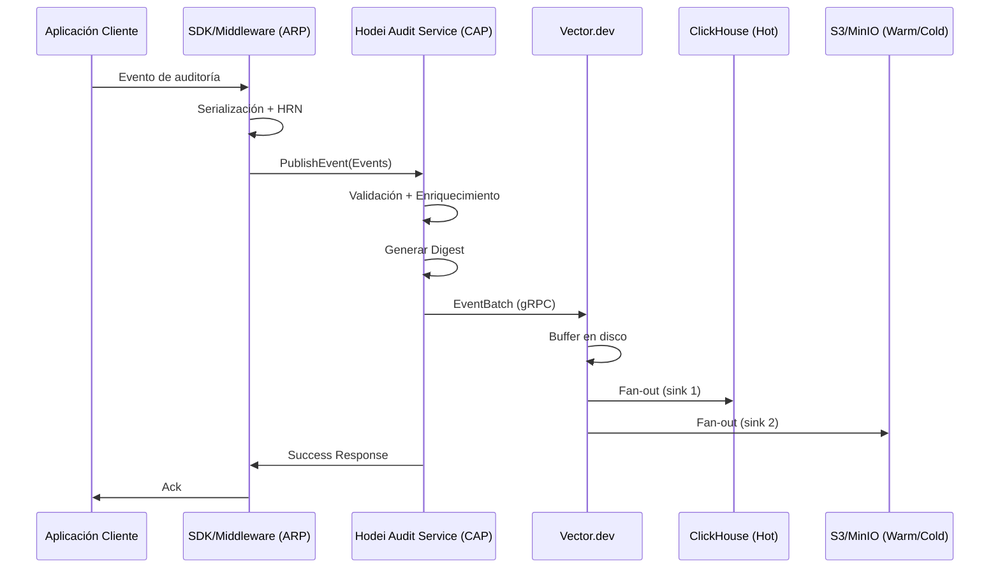
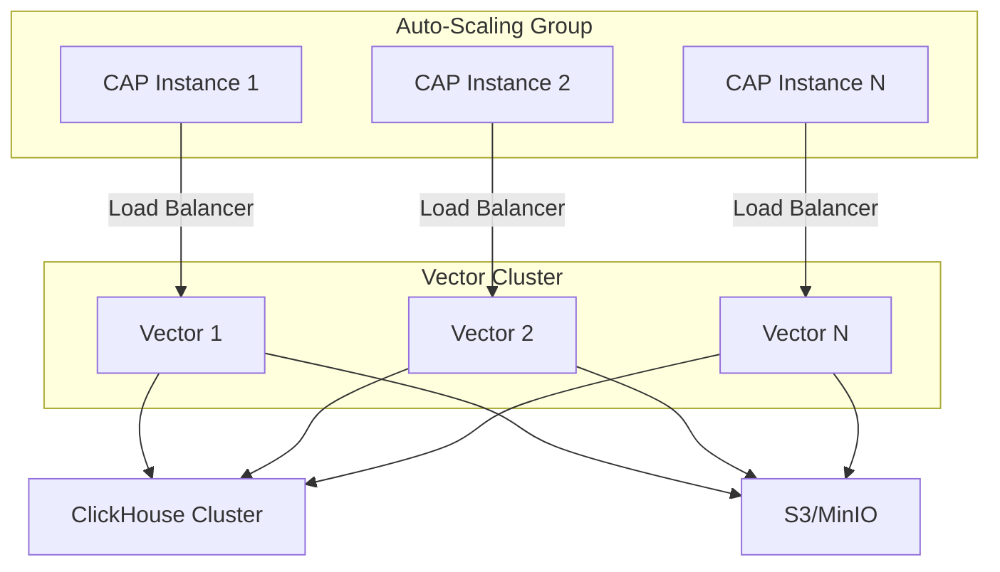

# Arquitectura CAP/ARP con Vector.dev

## 📋 Resumen Ejecutivo

Este documento define la arquitectura **CAP/ARP (Centralized Audit Point / Audit Reporting Point)** para Hodei Audit Service, integrada con **Vector.dev** para ingesta, buffering y fan-out de eventos de auditoría.

**Fecha**: 2025-01-15
**Versión**: 1.0
**Estado**: Aprobado

---

## 🎯 Arquitectura CAP/ARP

### Definición de Componentes

#### CAP (Centralized Audit Point)
**Responsabilidad**: Punto centralizado de ingestión, procesamiento y lógica de negocio de eventos de auditoría.

**Responsabilidades**:
- Recepción de eventos desde múltiples ARPs (Audit Reporting Points)
- Validación y enriquecimiento de eventos
- Aplicación de políticas de retención y filtrado
- Generación de digests criptográficos
- Coordinación con Vector.dev para fan-out
- Enrutamiento a múltiples storage backends (ClickHouse, S3)

**Puerto gRPC**: 50052 (ingestión), 50053 (query), 50054 (crypto)

#### ARP (Audit Reporting Point)
**Responsabilidad**: Punto de reporte de auditoría - SDK/middleware en aplicaciones cliente.

**Responsabilidades**:
- Captura de eventos en aplicaciones cliente
- Serialización de eventos según contratos gRPC
- Reintento y buffering local en caso de fallos
- Batching de eventos para optimizar throughput
- Resolución de HRNs (Hodei Resource Names)

**Puerto gRPC**: 50052 (hacia CAP)

#### Vector.dev
**Responsabilidad**: Plataforma de ingesta, buffering y fan-out de eventos.

**Responsabilidades**:
- Recepción de eventos desde CAP vía gRPC
- Buffering persistente en disco (zero-loss)
- Fan-out automático a múltiples sinks:
  - ClickHouse (hot storage)
  - S3/MinIO (warm/cold storage)
  - Vector/remap (transformación)
- Reintento automático con backoff exponencial
- Métricas nativas para observabilidad

**Puerto gRPC**: 50051 (desde CAP)

---

## 🔄 Flujo de Datos CANÓNICO



**Flujo CANÓNICO**:
```
App → ARP → CAP → Vector → Storage
```

Descripción del flujo:
- **App**: Aplicación cliente
- **ARP**: SDK/Middleware (Audit Reporting Point)
- **CAP**: Hodei Audit Service (Centralized Audit Point)
- **Vector**: Vector.dev
- **Storage**: ClickHouse (hot) + S3 (warm/cold)

---

## 🔍 Comparación con Patrones PDP/PEP

### Patrón PDP/PEP (Verified Permissions)

**PDP (Policy Decision Point)**:
- Punto centralizado de decisión de políticas
- Evaluaciones síncronas de acceso
- Alto acoplamiento con aplicaciones cliente

**PEP (Policy Enforcement Point)**:
- Punto de ejecución de políticas
- Intercepta requests en tiempo real
- Latencia crítica (bloquea request principal)

### Patrón CAP/ARP (Hodei Audit)

**CAP (Centralized Audit Point)**:
- Punto centralizado de auditoría
- **Asíncrono** - no bloquea request principal
- Enfoque en compliance y observabilidad
- Decoupling completo de lógica de negocio

**ARP (Audit Reporting Point)**:
- Middleware/SDK no intrusivo
- Captura y reporta eventos
- Batching para optimizar performance

### Ventajas de CAP/ARP vs PDP/PEP

| Aspecto | PDP/PEP | CAP/ARP |
|---------|---------|---------|
| **Acoplamiento** | Alto (síncrono) | Bajo (asíncrono) |
| **Latencia** | Crítica | No bloqueante |
| **Complejidad** | Alta (en runtime) | Baja (fuera de request) |
| **Escalabilidad** | Challenging | Excelente |
| **Casos de Uso** | Authorization | Audit/Compliance |
| **Tolerancia a Fallos** | Baja | Alta (buffering) |

---

## 📊 Tabla de Responsabilidades

| Componente | Responsabilidades Primarias | Tecnologías | Puerto |
|------------|-----------------------------|-------------|--------|
| **ARP** | - Captura de eventos<br>- Serialización<br>- HRN resolution<br>- Batching | Rust SDK<br>gRPC (Tonic) | - |
| **CAP** | - Validación<br>- Enriquecimiento<br>- Crypto digest<br>- Coordinación Vector<br>- Query API | Rust<br>gRPC (Tonic)<br>ClickHouse Client | 50052/50053/50054 |
| **Vector.dev** | - Buffering persistente<br>- Fan-out<br>- Retry logic<br>- Transformación | Vector<br>vector.toml | 50051 (gRPC) |
| **ClickHouse** | - Hot storage<br>- Query rápida<br>- Agregaciones | ClickHouse | 8123/9000 |
| **S3/MinIO** | - Warm/Cold storage<br>- Archival<br>- Long-term retention | S3 API<br>MinIO | 9000/9001 |

---

## 🔄 Contrato CAP → Vector (SIMPLE)

El contrato entre CAP y Vector.dev es **deliberadamente simple** para minimizar acoplamiento:

### Request (CAP → Vector)
```protobuf
message EventBatchRequest {
  repeated AuditEvent events = 1;
  string tenant_id = 2;
  uint64 batch_id = 3;
}
```

### Response (Vector → CAP)
```protobuf
message EventBatchResponse {
  bool success = 1;
  string message = 2;
  uint64 accepted_count = 3;
}
```

**Filosofía**: CAP envía batch → Vector responde con confirmación simple. Todo el routing, buffering y fan-out es responsabilidad de Vector.

---

## 🚀 Ventajas de la Arquitectura CAP/ARP/Vector

### 1. Desacoplamiento
- **CAP**: Lógica de negocio y procesamiento
- **Vector**: Infraestructura de datos
- **Separation of concerns** clara

### 2. Escalabilidad
- **CAP**: Escala horizontalmente para procesamiento
- **Vector**: Escala para fan-out y buffering
- Independent scaling

### 3. Simplicidad Operacional
- **Una sola herramienta** para ingesta/fan-out (Vector)
- **Configuración declarativa** (vector.toml)
- **Métricas nativas** (Prometheus)

### 4. Resiliencia
- **Buffer persistente** en Vector (disk buffer)
- **Zero-loss** en caso de fallos
- **Reintentos automáticos** con backoff

### 5. Flexibilidad
- **Múltiples sinks** sin código adicional
- **Transformaciones** declarativas
- **Routing** basado en tenant/event type

---

## 📈 Escalabilidad y Performance

### Throughput Target
- **100,000+ eventos/segundo** (aggregate)
- **< 100ms** para queries P95
- **99.9% availability**

### Escenario de Escalado



### Estrategia de Escalado
1. **CAP**: Horizontal scaling basado en CPU/memoria
2. **Vector**: Scaling basado en throughput de eventos
3. **Storage**: ClickHouse cluster + S3 bucket policies

---

## 🔐 Seguridad y Compliance

### Principios de Seguridad
- **Zero-trust** entre componentes
- **mTLS** para todas las comunicaciones gRPC
- **Encryption at rest** (ClickHouse + S3)
- **Role-based access** control (RBAC)

### Compliance
- **SOC2 Type II** ready (Epic 6)
- **PCI-DSS** compatible
- **Tamper-evident** logs (digest chain)
- **Retention policies** configurables

---

## 📋 Decisiones Arquitectónicas (ADR)

### ADR-001: CAP/ARP Pattern
**Status**: Aceptado
**Contexto**: Necesidad de sistema de auditoría descentralizado pero centralizado
**Decisión**: Adoptar CAP/ARP para desacoplar auditoría de lógica de negocio
**Consecuencias**: Mayor flexibilidad, menor acoplamiento, mejor escalabilidad

### ADR-002: Vector.dev para Fan-out
**Status**: Aceptado
**Contexto**: Necesidad de fan-out a múltiples storage backends
**Decisión**: Usar Vector.dev como plataforma de ingesta y routing
**Consecuencias**: Simplicidad operacional, configuración declarativa, métricas nativas

### ADR-003: Contrato Simple CAP → Vector
**Status**: Aceptado
**Contexto**: Minimizar acoplamiento entre CAP y Vector
**Decisión**: Contrato simple: batch → confirmación
**Consecuencias**: Mayor flexibilidad, menor superficie de fallos

---

## 📚 Referencias

- [AWS CloudTrail Architecture](https://docs.aws.amazon.com/awscloudtrail/latest/userguide/cloudtrail-concepts.html)
- [Vector.dev Documentation](https://vector.dev/docs/)
- [ClickHouse Documentation](https://clickhouse.com/docs/)
- [gRPC Documentation](https://grpc.io/docs/)

---

**Autor**: Equipo de Arquitectura Hodei
**Revisores**: Equipo Técnico
**Aprobado**: ⏳ Pendiente de revisión
