# Clon de AWS IAM con Rust: Análisis de Ingeniería Inversa y Guía de Implementación

## Tabla de Contenidos

1. [Introducción al Desafío de IAM](#introducción)
2. [Parte I: Análisis de Ingeniería Inversa de AWS IAM](#parte-i)
3. [Parte II: Diseño e Implementación del Clon en Rust](#parte-ii)
4. [Parte III: Conclusiones y Hoja de Ruta](#parte-iii)

---

## Introducción

AWS Identity and Access Management (IAM) es comúnmente malinterpretado como un simple servicio de autenticación y gestión de usuarios. En realidad, es uno de los sistemas de autorización distribuidos a hiperescala más complejos y críticos del mundo.

IAM es el tejido conectivo de la seguridad que subyace a cada una de las más de 200 servicios de AWS, procesando **miles de millones de solicitudes de API por segundo** con una latencia de microsegundos.

> ⚠️ **Importante**: Replicar la funcionalidad de IAM no es construir una API CRUD sobre una base de datos de usuarios. Es un ejercicio de ingeniería de sistemas distribuidos a escala global que debe reconciliar:
> - Consistencia eventual
> - Alta disponibilidad
> - Baja latencia
> - Un motor de lógica de autorización formalmente verificable

Este informe presenta una disección profunda de la arquitectura, las características y la lógica interna de AWS IAM, derivando un modelo de dominio y un plan de implementación para construir un clon de alta fidelidad, seguro y de alto rendimiento utilizando **Rust**.

---

## Parte I: Análisis de Ingeniería Inversa de AWS IAM

### 1. Modelo de Dominio y Características Funcionales Fundamentales

#### 1.1 Entidades Principales (Principals)

Las entidades principales son el corazón del modelo de identidad, representando a un actor que puede realizar acciones.

##### Usuario (User) de IAM
- **Definición**: Entidad fundamental que representa a una persona o aplicación
- **Características**:
  - Credenciales permanentes (contraseña para consola)
  - Claves de acceso (AKIA...) para acceso programático
  - Puede ser miembro de grupos

##### Grupo (Group) de IAM
- **Definición**: Contenedor para adjuntar políticas de permisos a múltiples usuarios
- **Restricciones**:
  - No es una identidad verdadera
  - No puede ser autenticado
  - No puede realizar acciones por sí mismo
  - Propósito: gestión de permisos en lote

##### Rol (Role) de IAM
- **Definición**: La entidad más potente y flexible
- **Características clave**:
  - No tiene credenciales permanentes
  - Diseñado para ser asumido temporalmente
  - Mantiene **dos tipos de políticas ortogonales**:
    1. **Política de Confianza (Trust Policy)**: Define quién puede asumir este rol (AuthN)
    2. **Políticas de Permisos (Permission Policies)**: Define qué puede hacer el rol (AuthZ)

Esta separación explícita de AuthN y AuthZ dentro de la entidad del Rol es el diseño fundamental que permite el acceso entre cuentas y toda la federación de identidades.

#### 1.2 Características de Credenciales y Seguridad

IAM gestiona el ciclo de vida completo de las credenciales:

- **Gestión de Contraseñas**: Rotación y políticas de complejidad
- **Claves de Acceso**: Credenciales de larga duración para API
- **Autenticación Multifactor (MFA)**: TOTP, FIDO/U2F, WebAuthn

#### 1.3 Herramientas de Análisis y Auditoría

- **IAM Access Analyzer**: Utiliza "razonamiento lógico" y "seguridad demostrable"
- **Reportes de Credenciales**: Estado completo de todas las credenciales
- **Integración con CloudTrail**: Pista de auditoría inmutable de todas las operaciones

### 2. Arquitectura del Sistema Global

La característica más importante de la arquitectura de IAM es su división en **dos planos de servicio distintos**.

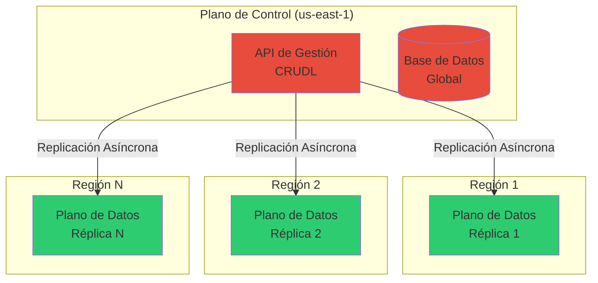

#### 2.1 El Plano de Control (Control Plane)

**Función**: Operaciones de "escritura" o mutación de estado
- Maneja las API CRUDL (Crear, Leer, Actualizar, Borrar, Listar)
- Ejemplo: crear usuarios, actualizar políticas, eliminar roles

**Arquitectura**:
- Servicio **global y singular**
- Ubicado físicamente en **us-east-1** (Norte de Virginia)

#### 2.2 El Plano de Datos (Data Plane)

**Función**: Operaciones de "lectura" de alto rendimiento
- Responde la pregunta: **"¿Está esta solicitud permitida o denegada?"**
- Maneja autenticación y autorización en tiempo real

**Arquitectura**:
- Servicio **regionalizado y replicado**
- Cada región tiene una instancia completamente independiente
- Distribuido en **mínimo 3 Zonas de Disponibilidad (AZ)**

#### 2.3 Flujo de Datos, Consistencia y Rendimiento

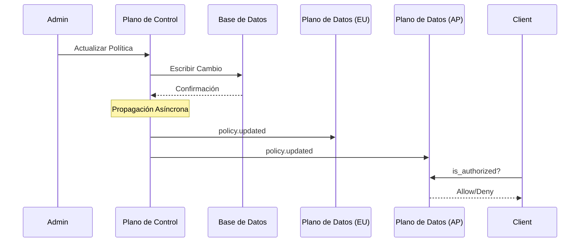

**Propagación y Consistencia Eventual**:
- Los cambios no son instantáneos
- Retraso de segundos a minutos
- **Consistencia eventual** por diseño

**Resiliencia ("Estabilidad Estática")**:
- Si el Plano de Control falla, el Plano de Datos sigue funcionando
- Opera sobre la última instantánea replicada

**Rendimiento**:
- Maneja **más de mil millones de autorizaciones por segundo**
- Réplica de datos de solo lectura, probablemente en memoria
- Latencia de microsegundos

#### 2.4 Inferencia de la Capa de Persistencia

El Plano de Control requiere una base de datos global con replicación multirregional.

**Implementación inferida**: Amazon DynamoDB Global Tables
- Base de datos multirregional y multimaestro
- Replicación asíncrona
- Estrategia de reconciliación "último escritor gana"

### 3. Motor de Autorización (AUTHENGINE)

Este es el núcleo intelectual de IAM: el motor que decide si una solicitud es **Allow** o **Deny**.

#### 3.1 Lógica de Evaluación de Múltiples Políticas

El motor sigue una cascada de evaluación estricta donde la **denegación tiene prioridad**.

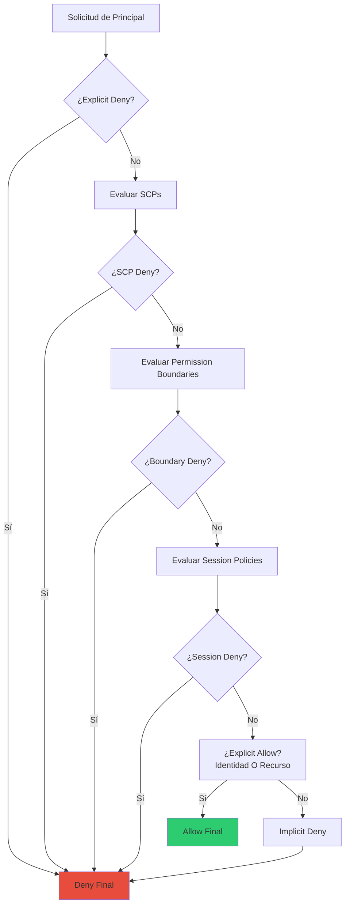

**Tabla de Evaluación de Políticas**:

| Paso | Tipo de Política | Fuente | Propósito | Lógica de Decisión |
|------|-----------------|--------|-----------|-------------------|
| 1 | Denegación Explícita | Todas | Anulación de Seguridad | Si CUALQUIER política coincidente = Deny → Deny Final |
| 2 | SCP (Organizations) | Raíz/OU de la Cuenta | Barandilla de la Cuenta | Si no está permitido explícitamente → Deny Final |
| 3 | Límite de Permisos | Principal (Usuario/Rol) | Barandilla de la Entidad | Si no está permitido explícitamente → Deny Final |
| 4 | Política de Sesión | Contexto de STS | Barandilla de la Sesión | Si no está permitido explícitamente → Deny Final |
| 5 | Identidad + Recursos | Principal + Recurso | Concesión de Permisos | Si (Identidad=Allow) O (Recurso=Allow) → Allow Final |
| 6 | Denegación Implícita | Predeterminado | Menor Privilegio | Si ningún Allow coincide → Deny Final |

#### 3.2 La Complejidad Oculta: Delegación vs. Lógica Booleana

El modelo documentado públicamente es una simplificación. La investigación de AWS revela complejidad crítica: **la lógica no es una simple intersección booleana**.

**Escenario de acceso entre cuentas**:
- **Principal**: Rol 111/Ace
- **Recurso**: Bucket 222/Photo
- **Política de Identidad** (en 111/Ace): Allow s3:GetObject en 222/Photo
- **Política de Recursos** (en 222/Photo): Allow s3:GetObject al Principal 111, no menciona 111/Ace

**Un análisis booleano simple** fallaría (denegaría el acceso), pero AWS **Permite** esta solicitud.

**Razón**: El AUTHENGINE modela explícitamente la **delegación**. La Cuenta 111 delega el permiso al rol 111/Ace a través de la política de identidad.

#### 3.3 ZELKOVA y IAM-MULTIPOLICYANALYZER

AWS utiliza internamente **métodos formales**:

1. **ZELKOVA**: Motor que formaliza una política individual
   - Compila el JSON de IAM en representación lógica semántica
   - Fórmula de Satisfiability Modulo Theories (SMT)

2. **IAM-MULTIPOLICYANALYZER**: Modelo de nivel superior que replica el AUTHENGINE
   - Utiliza un Lenguaje Específico de Dominio (DSL)
   - Orquestra múltiples llamadas a ZELKOVA
   - Modela la delegación explícitamente

**Para el escenario anterior**, el motor emite dos consultas de ZELKOVA:
1. `EvalCtx({111/Ace, a, r}, PR, ALLOW)` → No
2. `EvalCtx({111, a, r}, PR, ALLOW)` → Sí

**Lógica final**: `Allow_Identidad && (Allow_Recurso_Directo | Allow_Recurso_Delegado)`

### 4. Patrones de Integración y Federación (Autenticación)

Esta sección se enfoca en **Autenticación (AuthN)**. ¿Cómo prueba un principal que es quien dice ser?

#### 4.1 Autenticación de API: AWS Signature Version 4 (SigV4)

SigV4 es el protocolo universal y no negociable para autenticar solicitudes programáticas.

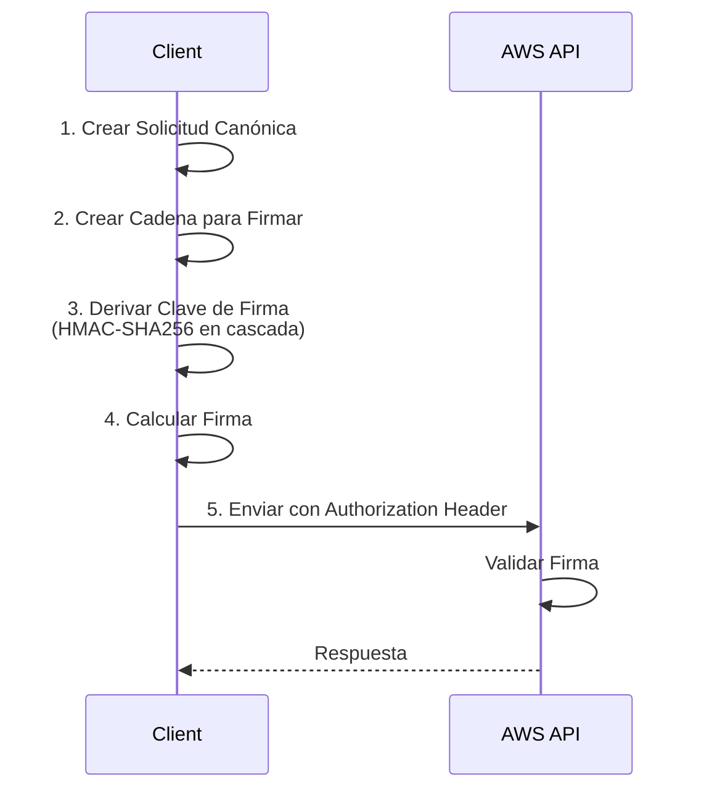

**Proceso criptográfico**:
1. **Crear Solicitud Canónica**: Representación normalizada (método, URI, headers, hash del cuerpo)
2. **Crear Cadena para Firmar**: Incluye algoritmo, timestamp, alcance de credenciales
3. **Derivar Clave de Firma**: HMAC-SHA256 en cascada (Secreta → Fecha → Región → Servicio → Firma)
4. **Calcular Firma**: HMAC-SHA256 de la cadena para firmar
5. **Agregar Firma**: En el header Authorization

#### 4.2 Federación de Identidades: El Rol de STS

IAM permite que identidades externas accedan a los recursos de AWS a través de **STS** (Security Token Service).

##### Federación SAML 2.0 (SSO Empresarial)

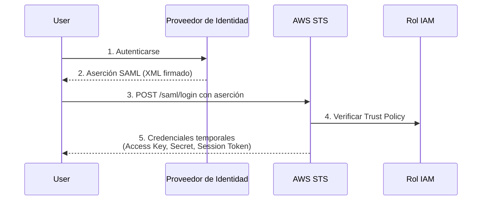

**Flujo completo**:
1. Usuario se autentica en el portal corporativo (IdP)
2. IdP genera Aserción SAML (documento XML firmado)
3. Navegador envía aserción al endpoint de AWS
4. AWS valida la aserción y llama `sts:AssumeRoleWithSAML`
5. STS verifica la Política de Confianza del rol
6. STS acuña credenciales temporales

##### Federación OIDC (Web/CI/CD)

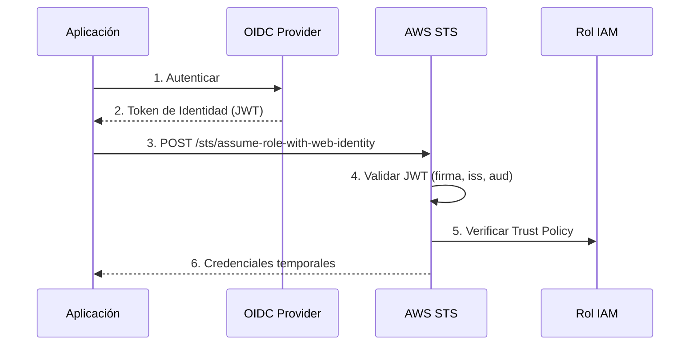

**Flujo completo**:
1. Aplicación se autentica con IdP OIDC
2. IdP emite Token de Identidad (JWT)
3. Aplicación llama `sts:AssumeRoleWithWebIdentity`
4. STS valida el JWT (firma, emisor, audiencia)
5. STS verifica la Política de Confianza
6. STS acuña credenciales temporales

**Resumen**: SAML (XML, maduro) y OIDC (JWT, ligero) son fachadas que abstraen el mismo mecanismo central: **validar una aserción externa para acuñar credenciales internas**.

---

## Parte II: Diseño e Implementación del Clon en Rust

Basado en el análisis de ingeniería inversa, se propone una **arquitectura de microservicios** aprovechando axum y bibliotecas seguras de alto rendimiento de Rust.

### 5. Arquitectura del Clon: Contextos Delimitados (Bounded Contexts)

Aplicando **Domain-Driven Design (DDD)**, el sistema se descompone en microservicios especializados:

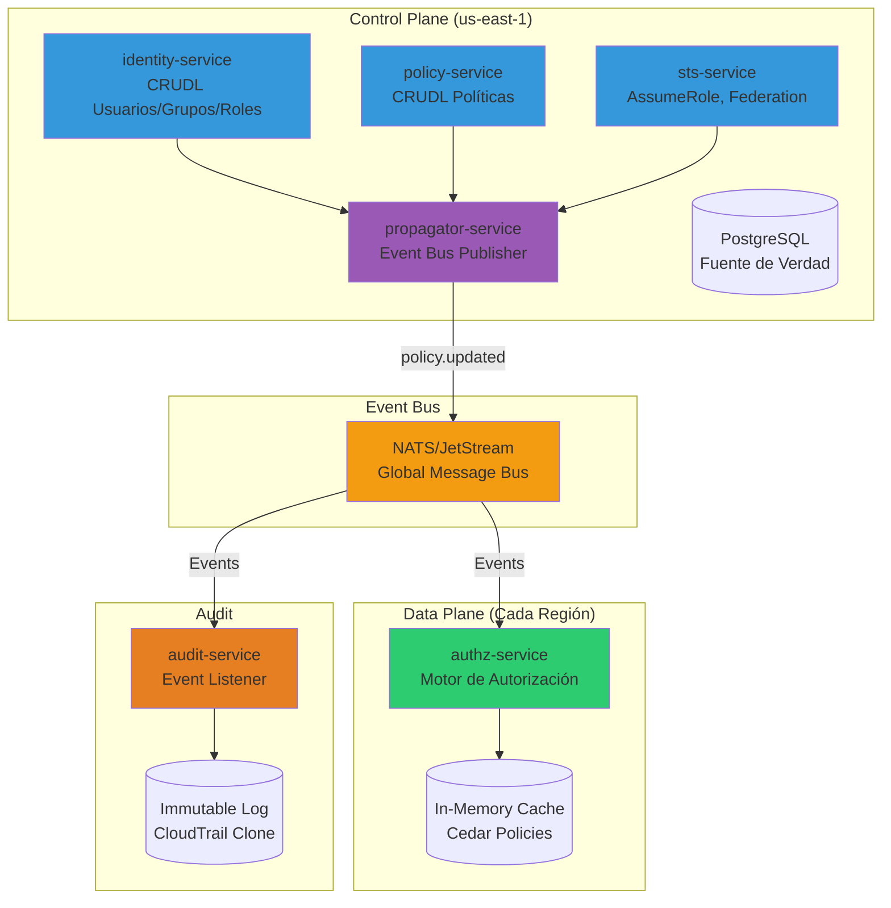

#### **1. identity-service** (Contexto de Identidad)
- **Plano**: Control
- **Responsabilidad**: CRUDL para Usuarios, Grupos y definiciones de Roles
- **Gestiona**: Credenciales de larga duración (contraseñas hasheadas, claves de acceso)

#### **2. policy-service** (Contexto de Política)
- **Plano**: Control
- **Responsabilidad**: CRUDL para documentos de políticas, versionado
- **Gestiona**: Asociaciones entre políticas y principales

#### **3. sts-service** (Contexto de Federación)
- **Plano**: Control
- **Responsabilidad**: Endpoints AssumeRole, AssumeRoleWithSAML, AssumeRoleWithWebIdentity
- **Función**: Valida aserciones externas y acuña tokens de sesión temporales

#### **4. authz-service** (Contexto de Autorización)
- **Plano**: Datos
- **Responsabilidad**: Motor de autorización en tiempo real
- **Endpoint**: `is_authorized(Principal, Action, Resource, Context)`
- **Características**: Sin estado, solo lectura, datos en memoria

#### **5. propagator-service** (Contexto de Propagación)
- **Plano**: Backend del Plano de Control
- **Responsabilidad**: Escucha eventos, los agrega y publica en bus de mensajes
- **Función**: Implementación de consistencia eventual

#### **6. audit-service** (Contexto de Auditoría)
- **Plano**: Suscriptor de Eventos
- **Responsabilidad**: Escucha eventos y los escribe en almacén inmutable
- **Función**: Clon de CloudTrail

### 6. Cimientos del Servicio: Framework y Autenticación con Axum

**Framework**: axum (sobre tokio)
- Diseño modular
- Integración estrecha con tokio
- Ecosistema de middleware basado en tower

**Autenticación para Servicios del Plano de Control**:

Utilizando `axum-login` con dos backends:

```rust
// Backend 1: Para usuarios humanos
PasswordBackend {
    hasher: Argon2, // Moderno, ganador del Password Hashing Competition
}

// Backend 2: Para acceso programático
SigV4Backend {
    // Implementación completa de SigV4
}
```

**Tokens de sesión temporales**: JWT
- `jsonwebtoken` o `jwt-simple` para crear y validar tokens

### 7. Implementación de la Federación (OIDC y SAML)

#### **Federación OIDC**

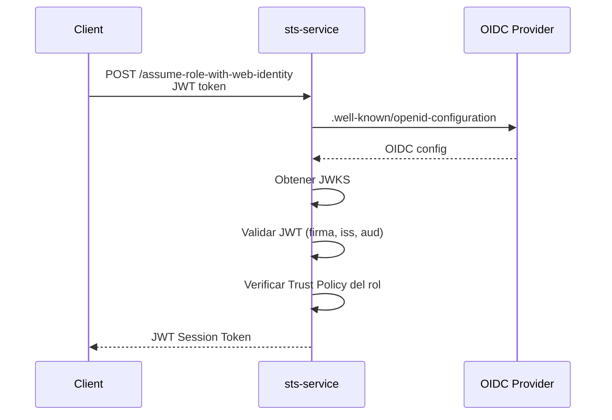

**Crate**: `openidconnect`
- Relying Party (RP) maduro
- Descubrimiento de configuración IdP
- Validación de JWT (firma, claims)

#### **Federación SAML**

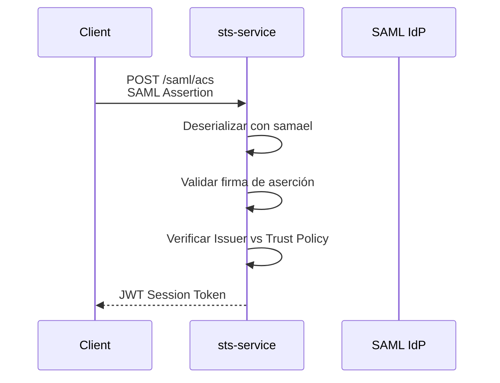

**Crate**: `samael`
- Service Provider (SP) funcional
- Serialización/deserialización XML SAML
- Validación de aserciones

### 8. El Núcleo: Motor de Evaluación de Políticas (AuthZ)

Esta es la decisión de diseño más crítica. ¿Cómo replicar el AUTHENGINE?

#### Comparativa de Enfoques

| Enfoque | Crate | Fidelidad a IAM-JSON | Rendimiento | Seguridad Verificable | Esfuerzo |
|---------|-------|---------------------|-------------|----------------------|----------|
| **Replicador JSON** | `iam-rs` | Baja (Falla en delegación) | Rápido | Baja (No verificado) | Bajo |
| **Replicador SMT** | `z3-rs` | Completa | Lento (SMT) | Alta (Verificado) | Extremo |
| **Motor Moderno** | `cedar-policy` | N/A (Reemplazo Superior) | Muy Rápido (Nativo de Rust) | Alta (Verificado por AWS) | Medio |

#### **Opción Recomendada: Cedar Policy**

**¿Por qué Cedar?**
- ✅ **Seguro**: Diseñado para análisis mediante "Razonamiento Automatizado" y verificación formal
- ✅ **Performante**: "Evaluación rápida y escalable en tiempo real, latencia acotada"
- ✅ **Nativo de Rust**: API simple vía `cedar-policy`

**Ejemplo de uso**:

```rust
use cedar_policy::{Request, PolicySet, Authorizer, Entities, Context, EntityUid};

let request = Request::new(
    Some(principal_uid),
    Some(action_uid),
    Some(resource_uid),
    Context::empty()
);

let authorizer = Authorizer::new();
let decision = authorizer.is_authorized(&request, &policy_set, &entities);
// decision.decision() == Decision::Allow
```

**Decisión Estratégica**: No construir un clon literal del legado (IAM-JSON), sino un clon arquitectónico (Control/Data Plane) que utilice el motor moderno (Cedar).

### 9. Consideraciones de Persistencia y Despliegue Global

#### **Plano de Control** (identity, policy, sts)
- **Persistencia**: PostgreSQL (sqlx o diesel)
- **Consistencia**: Fuerte (transaccional)
- **Despliegue**: Región única (us-east-1) - fuente global de verdad

#### **Plano de Datos** (authz-service)
- **Persistencia**: Caché en memoria (moka o dashmap)
- **Latencia**: Microsegundos
- **Despliegue**: Global en cada región

#### **El Puente** (propagator-service)

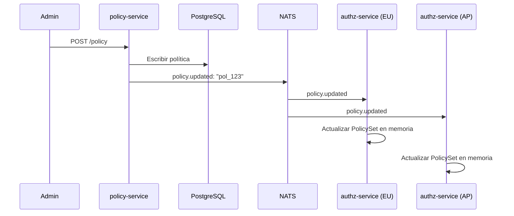

**Flujo de consistencia eventual**:
1. POST a `/policy` en policy-service (us-east-1)
2. Escribe en PostgreSQL
3. Publica evento: `policy.updated: "pol_123"`
4. authz-services en todas las regiones reciben evento
5. Actualizan atómicamente su PolicySet en memoria

**Diseño**: "escritura central, lectura distribuida" = alta disponibilidad + latencia ultrabaja

---

## Parte III: Conclusiones y Hoja de Ruta

### 10. Resumen de Pila Tecnológica y Hoja de Ruta

La ingeniería inversa de AWS IAM revela un sistema **sofisticado, resistente a fallos y formalmente verificado**, mucho más complejo que un servicio CRUD.

**Estrategia de implementación**: Adoptar el motor que AWS construyó para reemplazar IAM-JSON: **Cedar**.

#### **Pila Tecnológica Recomendada**

| Componente | Tecnología | Justificación |
|------------|-----------|---------------|
| **Framework Web** | axum (sobre tokio) | Ergonomómico, modular, alto rendimiento |
| **Autenticación API** | Implementación SigV4 + axum-login | Compatibilidad con herramientas AWS |
| **Hashing Contraseñas** | argon2 | Moderno, ganador del Password Hashing Competition |
| **Tokens Sesión** | jsonwebtoken | Estándar JWT, maduro |
| **Federación OIDC** | openidconnect | Implementación madura de OIDC |
| **Federación SAML** | samael | Funcionalidad SAML 2.0 |
| **Motor AuthZ** | **cedar-policy** | Verificable, de alto rendimiento, nativo de Rust |
| **Persistencia Control** | PostgreSQL (sqlx/diesel) | Base de datos transaccional robusta |
| **Caché Datos** | moka | Caché en memoria de alto rendimiento |
| **Eventos** | NATS (nats-rs) | Latencia ultrabaja, simplicidad operativa |

#### **Hoja de Ruta de Desarrollo**

##### **Módulo 0: El Núcleo de Autorización** (authz-service)
**Objetivo**: Comenzar por el final para validar la viabilidad

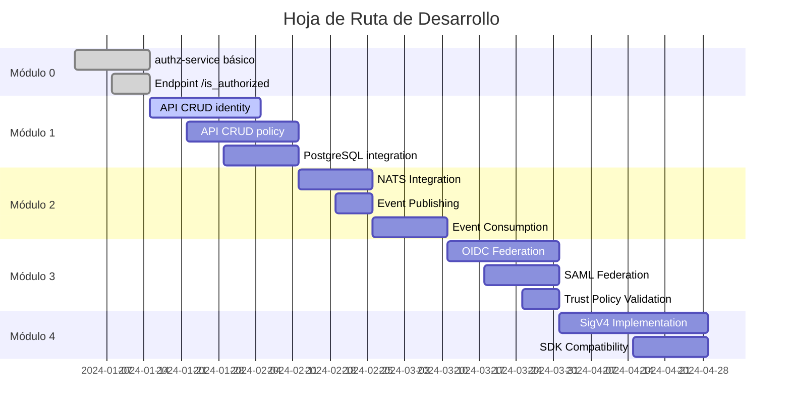

**Entregables**:
- Binario axum simple
- Carga políticas Cedar desde disco
- Endpoint POST `/is_authorized`
- Evaluación con `Authorizer.is_authorized()`

**Criterio de éxito**: Validar que Cedar puede manejar casos de uso complejos (delegación entre cuentas)

##### **Módulo 1: El Plano de Control** (identity y policy)
**Entregables**:
- API CRUD para crear usuarios, roles y políticas Cedar
- Integración con PostgreSQL vía sqlx
- Endpoints: `/users`, `/roles`, `/policies`

##### **Módulo 2: El Puente** (propagator-service)
**Entregables**:
- Integración NATS
- Publicación de eventos: `policy.updated`, `user.created`
- Suscripción en authz-service para actualización en tiempo real
- Actualización atómica de PolicySet en memoria

##### **Módulo 3: La Federación** (sts-service)
**Entregables**:
- Endpoints OIDC y SAML usando `openidconnect` y `samael`
- Validación de tokens externos
- Consulta de Políticas de Confianza
- Emisión de JWT internos

##### **Módulo 4: Autenticación de API** (SigV4)
**Entregables**:
- Implementación completa de SigV4Backend
- Validación de firmas criptográficas
- Compatibilidad con SDK de AWS

**Complejidad**: Alta, pero necesaria para ecosistema AWS

### Conclusión

Este enfoque modular resulta en un sistema que es **arquitectónicamente un clon de IAM** (separación Control/Data Plane, STS, consistencia eventual) pero que utiliza un **motor de autorización nativo de Rust, formalmente verificado y de mayor rendimiento**.

Cumple con todos los objetivos:
- ✅ **Seguridad**: Verificación formal (Cedar)
- ✅ **Rendimiento**: Nativo de Rust, latencia de microsegundos
- ✅ **Escalabilidad**: Arquitectura distribuida probada
- ✅ **Mantenibilidad**: Código Rust seguro y modular
- ✅ **Compatibilidad**: Estándares abiertos (OIDC, SAML, JWT)

---

## Referencias

1. An unexpected discovery: Automated reasoning often makes systems more efficient and easier to maintain | AWS Security Blog
2. How to monitor and query IAM resources at scale – Part 1 | AWS Security Blog
3. Barnett-2025-Modeling the AWS Authorization Engine-vor.pdf
4. IAM roles - AWS Identity and Access Management - AWS Documentation
5. What is IAM? - AWS Identity and Access Management
6. AWS Identity and Access Management Documentation
7. Policies and permissions in AWS Identity and Access Management
8. Service control policies (SCPs) - AWS Organizations
9. IAM policy evaluation logic explained with examples - Advanced Web Machinery
10. AWS IAM Persistence Methods - Hacking The Cloud
11. OIDC federation - AWS Identity and Access Management
12. AWS IAM Access Analyzer
13. Using AWS Identity and Access Management Access Analyzer - AWS Documentation
14. IAM Access Analyzer findings - AWS Identity and Access Management
15. Resilience in AWS Identity and Access Management
16. Control planes and data planes - AWS Fault Isolation Boundaries
17. Global services - AWS Fault Isolation Boundaries
18. Control planes and data planes - Advanced Multi-AZ Resilience Patterns
19. Troubleshoot IAM - AWS Identity and Access Management
20. How long should I wait after applying an AWS IAM policy before it is valid? - Stack Overflow
21. IAM eventual consistency and Terraform
22. AWS IAM keys are eventually consistent, Vault neglects to check or wait #3115 - GitHub
23. Building resilient multi-site workloads using AWS global services (SUP401) - YouTube
24. How DynamoDB global tables work - AWS Documentation
25. What is Amazon DynamoDB? - Amazon DynamoDB - AWS Documentation
26. Global tables: How it works - Amazon DynamoDB - AWS Documentation
27. AWS policy evaluation - amazon s3 - Stack Overflow
28. Comprehensive Guide of AWS IAM Policy evaluation logic - AWS Builder Center
29. AWS IAM: Policy Evaluation Logic — EXPLAINED | by Mehrdad...
30. Untangle AWS IAM Policy Logic and Move Toward Least Privilege - Sonrai Security
31. Understand how IAM policies and Organizations SCPs interact - AWS re:Post
32. IAM policy types: How and when to use them | AWS Security Blog
33. Permissions boundaries for IAM entities - AWS Identity and Access Management
34. Policy evaluation logic - AWS Identity and Access Management - AWS Documentation
35. Evaluation logic - Amazon Simple Notification Service
36. AWS Signature Version 4 for API requests - AWS Identity and Access Management
37. AWS Signature Version 4 (SigV4): a practical guide | by Chaos To Clarity - Medium
38. Create a signed AWS API request - AWS Identity and Access Management - AWS Documentation
39. Authenticating Requests (AWS Signature Version 4) - Amazon Simple Storage Service
40. IAM federation - AWS Prescriptive Guidance
41. Identity providers and federation - AWS Documentation
42. Enabling SAML 2.0 federated principals to access the AWS...
43. How to automate SAML federation to multiple AWS accounts from Microsoft Azure Active Directory | AWS Security Blog
44. AssumeRoleWithSAML - AWS Security Token Service
45. SAML Federated Identity for AWS Access with STS-Generated Short-Lived Credentials | by Mehrdad Mohsenizadeh
46. SAML 2.0 federation - AWS Identity and Access Management
47. Create an OpenID Connect (OIDC) identity provider in IAM - AWS Documentation
48. Configuring OpenID Connect in Amazon Web Services - GitHub Docs
49. Automating OpenID Connect-Based AWS IAM Web Identity Roles with Microsoft Entra ID
50. Identity pools authentication flow - Amazon Cognito - AWS Documentation
51. AssumeRoleWithWebIdentity - AWS Security Token Service
52. SAML vs OIDC: All You Need to Know - OneLogin
53. REL03-BP02 Build services focused on specific business domains and functionality - AWS Well-Architected Framework
54. Bounded Context - Martin Fowler
55. Overview - AWS Prescriptive Guidance
56. Foundational concepts - AWS Prescriptive Guidance
57. Identity and Access Management - Amazon EKS - AWS Documentation
58. tokio-rs/axum: Ergonomic and modular web framework built with Tokio, Tower, and Hyper
59. Using Rust and Axum to build a JWT authentication API - LogRocket Blog
60. Implementing Middleware in Rust - Shuttle.dev
61. maxcountryman/axum-login: User identification...
62. argonautica - Rust - Docs.rs
63. Encryption / Decryption with Rust | Good Resources / Crates? : r/rust - Reddit
64. Which crate should I use for Argon2? - help - The Rust Programming Language Forum
65. Awesome Rust Cryptography
66. Crate jsonwebtoken - Rust - Docs.rs
67. Authenticate Service Account in Rust with JWT(JSON Web Tokens) | by Itsuki - Medium
68. jwt-simple - crates.io: Rust Package Registry
69. 3691-trusted-publishing-cratesio - The Rust RFC Book
70. openidconnect - Rust - Docs.rs
71. openidconnect - crates.io: Rust Package Registry
72. mcguinness/saml-sp: Simple Service Provider (SP) for SAML 2.0 Web SSO
73. njaremko/samael: A SAML2 library for Rust - GitHub
74. samael - crates.io: Rust Package Registry
75. samael 0.0.4 - Docs.rs
76. iam-rs - crates.io: Rust Package Registry
77. iam_rs - Rust - Docs.rs
78. prove-rs/z3.rs: Rust bindings for the Z3 solver. - GitHub
79. Verbal Arithmetic In Rust And Z3 | Simon Vandevelde Homepage
80. Introduction | Online Z3 Guide
81. z3 - Rust - Docs.rs
82. How we designed Cedar to be intuitive to use, fast, and safe | AWS Security Blog
83. Cedar: A new policy language - One Cloud Please
84. Two New Open Source Rust Crates Create Easier Cedar Policy Management
85. Implementation of the Cedar Policy Language - GitHub
86. What is Cedar? | Cedar Policy Language Reference Guide
87. Cedar Language
88. Introducing Cedar, an open-source language for access control - Amazon AWS
89. Cedar overview - AWS Prescriptive Guidance
90. cedar_policy - Rust - Docs.rs
91. Tutorial | Cedar language
92. Attribute-based access control (part 1) - Tutorial | Cedar language
93. Using Open Source Cedar to Write and Enforce Custom Authorization Policies
