# Análisis Arquitectónico: Implementación de Dominios de Servicio Fundamentales con Keycloak y Ecosistemas de Cómputo Nativos de la Nube

## Tabla de Contenidos

1. [Introducción: El Dilema "Construir vs. Adoptar"](#introducción)
2. [Dominio 1: Identidad y Autenticación](#dominio-1)
3. [Dominio 2: Autorización de Grano Fino](#dominio-2)
4. [Dominio 3: Delegación Segura](#dominio-3)
5. [Dominio 4: Replicación Asíncrona de Estado](#dominio-4)
6. [Dominio 5: Auditoría y Eventos de Seguridad](#dominio-5)
7. [Dominio 6: Contexto Operativo](#dominio-6)
8. [Conclusiones y Recomendaciones](#conclusiones)

---

## Introducción: El Dilema "Construir vs. Adoptar" para Contextos Delimitados Críticos

### Planteamiento del Problema

En la arquitectura de software contemporánea, el desafío central para los arquitectos de soluciones y líderes técnicos ya no es **si** se deben utilizar microservicios, sino **cómo** gestionarlos eficazmente a escala.

La adopción de principios de **Domain-Driven Design (DDD)** ha sido fundamental para gestionar esta complejidad, permitiendo a las organizaciones modelar sistemas complejos como una federación de **"Contextos Delimitados" (Bounded Contexts)** cohesivos y de acoplamiento flexible.

Históricamente, muchos de estos contextos críticos (gestión de usuarios, autorización, auditoría) se construían a medida. Este enfoque, si bien proporcionaba control total, conllevaba una **inmensa carga de ingeniería**, desviando recursos valiosos del dominio de negocio principal.

### La Hipótesis de la "Suplantación"

Este informe se basa en una tesis central:

> **Las plataformas de software de código abierto (open source) y comerciales (COTS) han alcanzado un nivel de madurez y sofisticación tal que ahora pueden "suplir" (suplantar) por completo dominios de servicio enteros.**

Esta suplantación permite a los equipos de ingeniería tratar estos dominios fundamentales como **utilidades configurables** en lugar de como desafíos de desarrollo de software.

### Definición de los Seis Contextos

Este análisis estructura la evaluación en torno a **seis Contextos Delimitados** universales en arquitecturas distribuidas a gran escala:

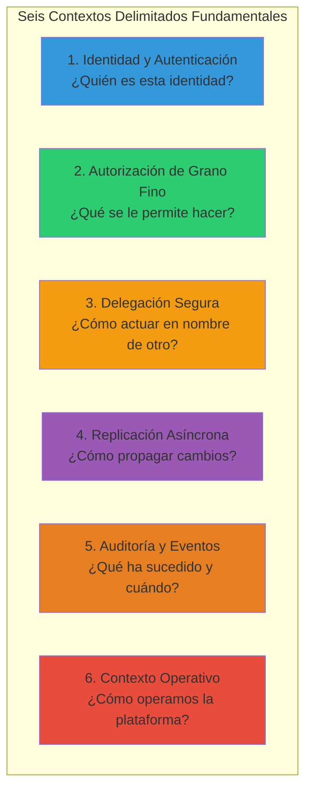

| Dominio | Pregunta Clave | Propósito |
|---------|----------------|-----------|
| **1. Identidad y Autenticación** | ¿Quién es este usuario o servicio? | Establecer y verificar identidad |
| **2. Autorización de Grano Fino** | ¿Qué se le permite hacer a esta identidad? | Control de acceso detallado |
| **3. Delegación Segura** | ¿Cómo puede un servicio actuar de forma segura en nombre de otro? | Confianza entre servicios |
| **4. Replicación Asíncrona de Estado** | ¿Cómo se propaga un cambio de estado de forma fiable? | Consistencia eventual |
| **5. Auditoría y Eventos de Seguridad** | ¿Qué ha sucedido en el sistema, quién lo hizo y cuándo? | Observabilidad y compliance |
| **6. Contexto Operativo** | ¿Cómo operamos, escalamos y mantenemos fiables las plataformas? | SRE y DevOps |

### El Rol de Keycloak como Plataforma Base

**Keycloak** servirá como plataforma base de análisis. No se trata como una solución monolítica, sino como un **ecosistema de servicios** que aborda múltiples contextos.

Para cada dominio, este informe evaluará:
- ✅ **Solución nativa** de Keycloak
- ⚠️ **Solución parcial** (requiriendo extensión)
- ❌ **Vacío** que debe ser llenado por tecnologías especializadas (OPA, Cedar, NATS)

El objetivo es proporcionar un **análisis de diligencia técnica exhaustivo**, comparando los trade-offs para tomar decisiones arquitectónicas fundamentadas sobre "construir vs. adoptar".

---

## Dominio 1: El Contexto Delimitado de Identidad y Autenticación

### Análisis del Dominio

Este contexto es **la piedra angular de toda la seguridad del sistema**. Su responsabilidad es única y crítica:

> **¿Quién es esta entidad (usuario, servicio, dispositivo) que intenta interactuar con el sistema?**

**Responsabilidades**:
- Gestión del ciclo de vida de la identidad
- Almacenamiento de credenciales
- Ejecución de flujos de autenticación
- Emisión de pruebas de identidad (tokens, aserciones)

### Keycloak como Solución "Lista para Usar"

Keycloak **no es una biblioteca**; es una implementación **completa y empaquetada** del Contexto Delimitado de Identidad y Autenticación.

#### Capacidades Nativas

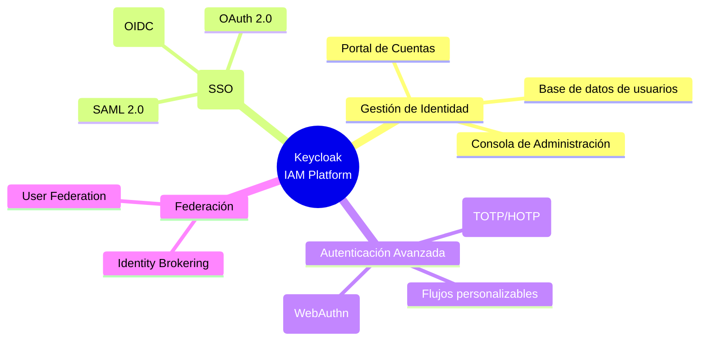

**Gestión de Identidad Centralizada**:
- ✅ Base de datos de usuarios integrada
- ✅ **Consola de Administración** para gestión del ciclo de vida
- ✅ **Portal de Cuentas** para usuarios finales

**Single Sign-On (SSO)**:
- ✅ Protocolos estándar: **OIDC, OAuth 2.0, SAML 2.0**
- ✅ Acceso a múltiples aplicaciones sin re-autenticación

**Mecanismos de Autenticación Avanzada**:
- ✅ **Flujos de Autenticación** personalizables
- ✅ **2FA/MFA**: TOTP/HOTP (Google Authenticator)
- ✅ **Passwordless**: W3C Web Authentication (WebAuthn) y Passkeys

### Patrones de Integración

#### 1. Federación de Usuarios (User Federation)

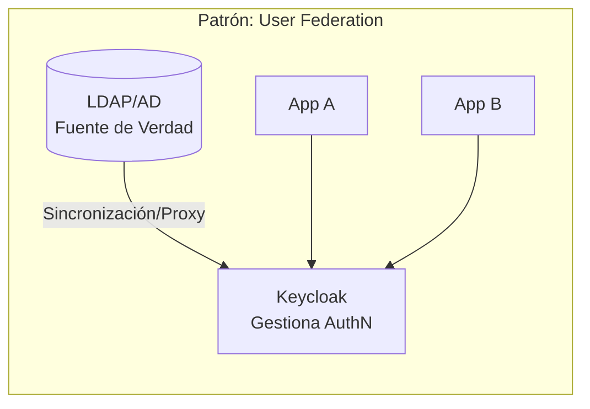

**Características**:
- Keycloak actúa como **fachada/proxy** para almacén externo
- Conectores integrados: **LDAP, Active Directory**
- Usuarios no se almacenan en Keycloak (o modo lectura/sincronización)
- Keycloak gestiona **autenticación**, fuente de verdad reside en sistema heredado

#### 2. Corretaje de Identidad (Identity Brokering)

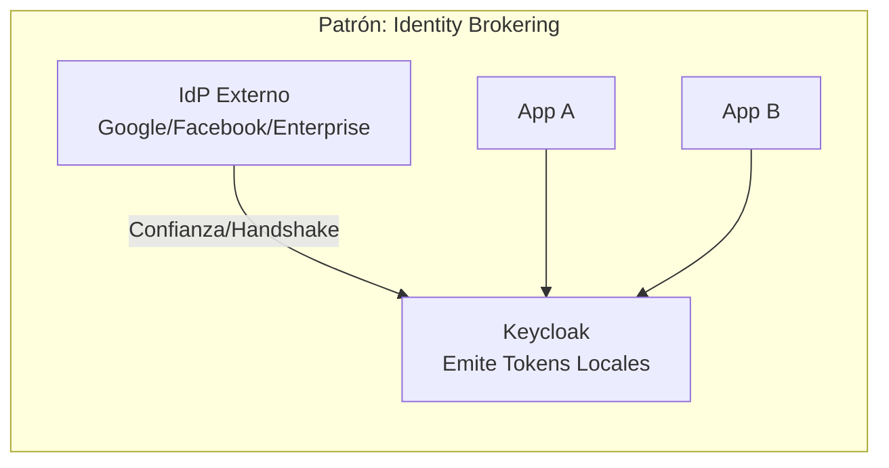

**Características**:
- Keycloak **delega completamente** la autenticación a IdP externo
- Ejemplos: "Iniciar sesión con Google", "Iniciar sesión con Facebook"
- Keycloak gestiona la **relación de confianza** (handshake OIDC/SAML)
- Recibe aserción de autenticación exitosa del IdP externo
- Crea sesión local y **emite sus propios tokens**

### Conclusión del Dominio 1

**Veredicto**: ✅ **Totalmente Suplantado**

Para el Contexto Delimitado de Identidad y Autenticación, Keycloak es una **solución integral y "lista para usar" (turnkey)**.

**Cumple robustamente** todos los aspectos centrales:
- ✅ Gestión del ciclo de vida
- ✅ Ejecución de SSO
- ✅ Autenticación avanzada
- ✅ Federación con sistemas externos

**Recomendación**: Dado el **costo, complejidad y riesgos de seguridad** asociados con construir un sistema de autenticación personalizado, se considera una **mala práctica de ingeniería moderna** intentar construir este contexto desde cero cuando existen soluciones maduras como Keycloak.

---

## Dominio 2: El Contexto Delimitado de Autorización de Grano Fino

### Análisis del Dominio

Este contexto representa **uno de los desafíos más complejos en la arquitectura de sistemas**.

- **Dominio 1** responde: **"¿Quién eres?"**
- **Dominio 2** debe responder: **"¿Qué se te permite hacer?"**

La autorización de grano fino es el mecanismo por el cual se aplica la **lógica de negocio y las reglas de seguridad** a cada solicitud de API, acceso a datos o acción del usuario.

> **Suplantar este contexto es intrínsecamente difícil** porque, a diferencia de la autenticación (que es universal), la autorización está **profundamente ligada a la lógica de negocio específica** de la aplicación.

### 2.1. El Modelo Nativo de Keycloak (Autorización Acoplada)

Keycloak intenta suplantar este contexto a través de sus **"Servicios de Autorización" (Authorization Services)**.

#### Arquitectura del Modelo

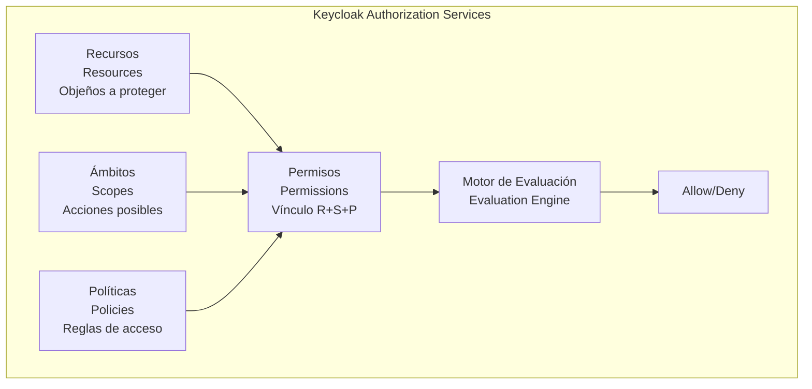

**Cuatro Componentes Primarios**:

#### 1. Recursos (Resources)
- **Definición**: Objetos que se están protegiendo
- **Ejemplo**: URI (`/api/accounts/{id}`), conjunto de URI, componente de UI

#### 2. Ámbitos (Scopes)
- **Definición**: Acciones o "verbos" sobre un recurso
- **Ejemplo**: `accounts:view`, `accounts:create`, `accounts:delete`

#### 3. Políticas (Policies)
- **Definición**: Reglas bajo las cuales se concede el acceso
- **Motor Polimórfico**:
  - **RBAC**: Acceso si el usuario tiene un rol específico
  - **ABAC**: Acceso basado en atributos del usuario/claims del token
  - **UBAC**: Acceso a un usuario específico por ID
  - **CBAC**: Acceso basado en contexto (IP, hora del día)
  - **Reglas Personalizadas**: JavaScript para lógica compleja

#### 4. Permisos (Permissions)
- **Definición**: Nexo que vincula Recurso/Ámbito a Política
- **Ejemplo**: "Permitir `accounts:view` en `/api/accounts` si Rol=Admin O Atributo-Dept=Finanzas"

#### Motor de Evaluación

**Principio**: "**Negación por defecto**" (deny-by-default)

```mermaid
flowchart LR
    A[Solicitud de Autorización] --> B[Crear Evaluation]
    B --> C[Evaluar Políticas]
    C --> D{¿Política concede?}
    D -->|Sí| E[grant()]
    D -->|No| F[Sin acción]
    E --> G[Estrategia de Decisión]
    F --> G
    G --> H[Affirmative: ≥1 concede]
    G --> I[Unanimous: todas conceden]
    H --> J[Allow]
    I --> J
```

**Estrategias de Decisión**:
- **Affirmative**: Al menos una política debe conceder
- **Unanimous**: Todas las políticas deben conceder

**User-Managed Access (UMA) 2.0**:
- Perfil de OAuth 2.0
- Permite a usuarios finales gestionar permisos de **sus propios recursos**
- Desacopla al propietario del recurso del servidor de recursos

#### Fortalezas y Limitaciones

**Fortalezas**:
- ✅ Excelente para **autorización a nivel de API** (grano grueso)
- ✅ Pregunta: "¿Puede el usuario 'Alice' (rol 'manager') ejecutar 'GET' en '/api/accounts'?"

**Limitaciones**:
- ❌ **Insuficiente para autorización de grano fino a nivel de datos**
- ❌ No responde eficientemente: "¿Qué filas de la tabla 'accounts' se le permite ver a 'Alice'? (ej. solo donde `accounts.region == alice.region`)"
- ❌ Requiere **filtrado de datos** (data filtering), patrón para el cual las soluciones de **PDP desacopladas** son más adecuadas

### 2.2. La Complejidad Teórica: Lecciones de AWS IAM

#### El Desafío de la Verificación Formal

**Paper**: "Modeling the AWS Authorization Engine" revela que la autorización a escala es un **problema de ciencias de la computación fundamentalmente difícil**.

**Descubrimiento clave**: El problema central no reside en las políticas individuales, sino en **la interacción de múltiples tipos de políticas** y, lo más importante, **en la delegación de permisos**.

> **"El elemento clave faltante es la capacidad de modelar cómo fluyen los permisos a través de las relaciones de delegación entre principales."**

#### Caso de Estudio: Acceso entre Cuentas

```mermaid
graph TB
    subgraph "Escenario: Cross-Account Access"
        subgraph "Cuenta 111"
            ROL[Rol: Ace]
            POL_ID[Política de Identidad<br/>Allow s3:GetObject en 222/Photo]
            ROL --> POL_ID
        end
        
        subgraph "Cuenta 222"
            BUCKET[Bucket S3: Photo]
            POL_RES[Política de Recursos<br/>Allow s3:GetObject a Principal 111<br/>(no menciona Ace)]
            BUCKET --> POL_RES
        end
        
        POL_ID -.->|Delega| POL_RES
    end
```

**El Problema**:
1. **Rol Ace** (Cuenta 111) intenta acceder a **Bucket Photo** (Cuenta 222)
2. **Política de Identidad** (Ace) permite explícitamente `s3:GetObject` en Photo
3. **Política de Recursos** (Photo) permite acceso a **Cuenta 111**, no a Rol Ace
4. **Análisis booleano simple** → Denegar (falla)
5. **AWS IAM** → Permitir ✅

**¿Por qué AWS Permite la Solicitud?**
- El motor modela **explícitamente el flujo de permisos**
- La política del bucket **delega confianza** a la Cuenta 111
- La Cuenta 111 (vía política de identidad) **delega ese permiso al Rol Ace**

#### La Solución de AWS: IAM-MULTIPOLICYANALYZER

**ZELKOVA** (v1):
- Capaz de analizar políticas **individuales**
- Insuficiente para razonar sobre la **seguridad del sistema en conjunto**

**IAM-MULTIPOLICYANALYZER** (v2):
- Modelo de nivel superior que **replica el AUTHENGINE**
- Utiliza un **Lenguaje Específico de Dominio (DSL)**
- **Orquestra múltiples llamadas a ZELKOVA**
- **Modela explícitamente la delegación**

**Consultas emitidas**:
1. `EvalCtx({111/Ace, a, r}, PR, ALLOW)` → No
2. `EvalCtx({111, a, r}, PR, ALLOW)` → Sí

**Lógica final**: `Allow_Identidad && (Allow_Recurso_Directo | Allow_Recurso_Delegado)`

### Implicaciones para Keycloak

**Brecha teórica**: El modelo de autorización nativo de Keycloak:
- ✅ **Útil** para autorización simple
- ❌ **Conceptualmente más simple** que el problema real
- ❌ Evalúa políticas en el contexto de **un único realm**
- ❌ **No está diseñado** para modelar formalmente las **complejas interacciones** de políticas de identidad, políticas de recursos y **delegaciones jerárquicas**

**Justificación fundamental**: Para **arquitecturas empresariales a gran escala** (multi-tenant, multi-departamento), se requiere un **Punto de Decisión de Políticas (PDP) externo y especializado** diseñado para modelar formalmente y verificar estas interacciones complejas.

### 2.3. Alternativas Desacopladas: OPA/Rego vs. Cedar

En una **arquitectura de PDP desacoplado**:

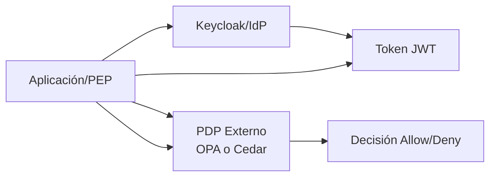

**Patrón**:
1. Aplicación (PEP) recibe **token JWT** de Keycloak
2. **No toma decisión** de autorización por sí misma
3. Envía token (y datos de solicitud) a **PDP externo**
4. PDP devuelve decisión: **allow o deny**

#### Opción 1: Open Policy Agent (OPA) y Rego

**Descripción**:
- Motor de políticas de **propósito general**
- **Open source**, graduado de **CNCF**
- Utiliza **Rego**: lenguaje declarativo inspirado en Datalog

**Ventajas**:
- ✅ **Flexibilidad Extrema**: Propósito general
  - RBAC, ABAC, ReBAC (Relationship-Based Access Control)
- ✅ **Ecosistema Maduro**: Adopción masiva
  - Kubernetes admission, validación Terraform, autorización API
  - Complementa políticas AWS IAM

**Desventajas**:
- ❌ **Complejidad**: La flexibilidad de Rego es un arma de doble filo
- ❌ Código Rego puede volverse "**extremadamente complejo de leer**"
- ❌ Sintaxis derivada de programación lógica **no es intuitiva** para la mayoría de desarrolladores

#### Opción 2: Cedar y Amazon Verified Permissions (AVP)

**Descripción**:
- **Lenguaje de políticas especializado** en autorización
- **Desarrollado y respaldado por AWS**
- **Amazon Verified Permissions (AVP)**: Servicio totalmente gestionado que utiliza Cedar

**Ventajas**:

1. **Seguridad y Verificabilidad**:
   - Diseñado desde el principio para **verificación formal**
   - Siguiendo los mismos principios que llevaron a AWS a crear IAM-MULTIPOLICYANALYZER
   - **"Seguro por diseño"** (type-safe, memory-safe)

2. **Legibilidad y Autoría Sencilla**:
   - Sintaxis **significativamente más intuitiva** que Rego
   - Estructura `permit / forbid` con cláusulas `when` (condiciones) y `unless` (excepciones)
   - **Legible y auditable** para personal no técnico

3. **Rendimiento**:
   - AWS afirma: **42-60 veces más rápido** que Rego para evaluación de políticas
   - Crítico para aplicaciones sensibles a la latencia

4. **Modelo de Evaluación**:
   - **Determinista** y de **orden independiente**
   - Previene bugs comunes en sistemas de autorización

**Desventajas**:
- ❌ **Ecosistema Joven**: Más nuevo, menor adopción que OPA
- ❌ Ecosistema de herramientas y adopción **más pequeños**

#### Comparativa: Rego vs. Cedar

**Ejemplo de política simple**: "Permitir a 'alice' leer 'document' si es la propietaria"

```rego
# OPA / Rego
package play

import future.keywords.if

default allow := false

allow if permit(input.principal, input.action, input.resource)

permit("alice", "read", "document") if input.resource_owner == input.principal
```

```cedar
// Cedar
permit(
    principal == User::"alice",
    action == Action::"read",
    resource == Document::"document"
) when {
    resource.owner == principal
};
```

**Análisis**: La sintaxis de Cedar es **más estricta, estructurada** y utiliza **palabras clave del dominio** (principal, action, resource), lo que aumenta drásticamente la claridad.

### 2.4. Tabla de Decisión: Comparativa de Motores de Políticas

| Característica | Keycloak Nativo | OPA / Rego | Cedar (AVP) |
|----------------|-----------------|------------|-------------|
| **Modelo de Acoplamiento** | Acoplado: PDP integrado en Keycloak | Desacoplado: Servidor OPA independiente | Desacoplado: Biblioteca (Rust) o servicio (AVP) |
| **Modelo de Políticas** | RBAC, ABAC, UBAC, CBAC, Reglas (JS) | Propósito General (RBAC, ABAC, ReBAC) | Especializado (RBAC, ABAC). Optimizado para Principal/Acción/Recurso |
| **Legibilidad/Autoría** | Moderada. Gestión UI compleja | Baja. Rego "extremadamente complejo de leer" | Alta. Sintaxis permit/forbid legible y auditable |
| **Verificación Formal** | No. No diseñado para esto | No. Naturaleza de propósito general difícil de verificar | Sí. Diseñado desde cero para verificación formal y análisis estático |
| **Rendimiento** | Moderado. Aceptable para API, acoplado al servidor | Bueno. Rápido, vulnerable a complejidad de política | Excelente. 42-60x más rápido que Rego (benchmarks AWS) |
| **Madurez/Ecosistema** | Alto (ecosistema Keycloak) | Muy Alto. Graduado CNCF, estándar de facto | Bajo/Medio. Ecosistema en crecimiento, respaldado por AWS |

### Conclusión del Dominio 2

**Veredicto**: ⚠️ **Parcialmente Suplantado**

**Keycloak puede suplantar competentemente**:
- ✅ **Autorización simple** o de **grano grueso** a nivel de API
- ✅ Excelente para: "¿Puede el usuario X ejecutar acción Y en endpoint Z?"

**Sin embargo, para requisitos avanzados** se recomienda **PDP desacoplado**:
- ❌ **Autorización de grano fino** (FGA) a nivel de datos
- ❌ Sistemas que exigen **alta seguridad, verificabilidad y rendimiento**

**La investigación de AWS** demuestra por qué la **composición de políticas y la delegación** son problemas teóricamente complejos que justifican un **motor especializado**.

**Entre alternativas, Cedar emerge como arquitectónicamente superior** sobre OPA específicamente para autorización de aplicaciones:
- ✅ **Legibilidad**
- ✅ **Verificabilidad formal**
- ✅ **Rendimiento bruto**

**OPA sigue siendo válido** para política de infraestructura de propósito general, pero **Cedar está optimizado** para el problema en cuestión.

---

## Dominio 3: El Contexto Delimitado de Delegación Segura (Confianza entre Servicios)

### Análisis del Dominio

Este contexto aborda un **patrón de interacción fundamental** en arquitecturas de microservicios.

> **¿Cómo puede el "Servicio A" (ej. servicio de pedidos) llamar de forma segura al "Servicio B" (ej. servicio de pagos) en nombre del Usuario X?**

**No es un problema de**:
- ❌ **Autenticación** (Usuario X ya está autenticado)
- ❌ **Autorización simple** (Servicio A está autorizado para llamar al Servicio B)

**Es un problema de**:
- ✅ **Delegación de identidad**

**Requisitos del Servicio B**:
1. Saber que la solicitud del Servicio A es **legítima**
2. Saber que se realiza en el **contexto de un usuario final específico**
3. Aplicar políticas basadas en la identidad tanto del **Servicio A** (el "actor") como del **Usuario X** (el "sujeto")

**Patrón**: Flujo **"act-on-behalf-of"**

### Keycloak como Solución "Lista para Usar" (Token Exchange)

Keycloak suplanta este contexto de forma **completa y elegante** a través de su implementación del estándar **OAuth 2.0 Token Exchange (RFC 8693)**.

#### Flujo de Token Exchange

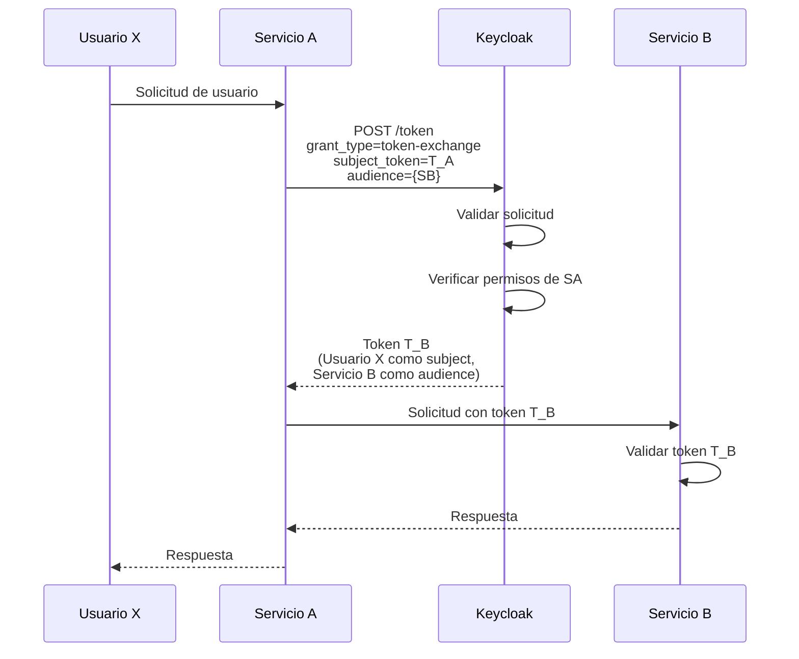

#### Análisis Detallado de la Carga Útil

**Solicitud POST al token endpoint**:

```http
POST /realms/{realm}/protocol/openid-connect/token
Content-Type: application/x-www-form-urlencoded

grant_type=urn:ietf:params:oauth:grant-type:token-exchange
subject_token={T_A}
subject_token_type=urn:ietf:params:oauth:token-type:access_token
audience={client_id_del_Servicio_B}
requested_token_type=urn:ietf:params:oauth:token-type:access_token
```

**Parámetros Críticos**:
- **`grant_type`**: `urn:ietf:params:oauth:grant-type:token-exchange`
- **`subject_token`**: `T_A` (token del usuario original)
- **`audience`**: Cliente ID del Servicio B (solicita token destinado al Servicio B)

#### Resultado del Intercambio

**Nuevo token `T_B`**:
- **Subject** (`sub`): Usuario X (sin cambios)
- **Audience** (`aud`): Servicio B (cambiado)
- **Actor** (`act`): Servicio A (claim que identifica al actor)
- **Expiry**: Corta duración

**Logrando perfectamente el patrón "act-on-behalf-of"** ✅

### Análogo en la Nube: AWS STS

Este patrón también existe en el ecosistema AWS, implementado conceptualmente de forma idéntica a través de **AWS STS** y la operación `AssumeRole`.

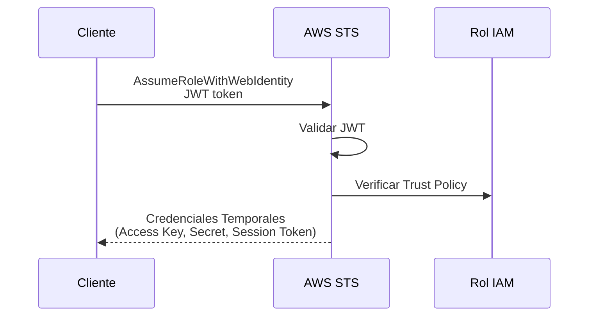

**Mecanismo de Confianza**:
- Rol de IAM debe tener **Política de Confianza** que permita explícitamente al IdP realizar `AssumeRole`
- **Credenciales temporales** expiran después de corta duración

### Comparativa: Keycloak Token Exchange vs. AWS STS

| Característica | Keycloak Token Exchange (RFC 8693) | AWS STS (AssumeRoleWithWebIdentity) |
|----------------|-----------------------------------|-------------------------------------|
| **Estándar** | OAuth 2.0 (RFC 8693) | Propietario de AWS (ampliamente adoptado) |
| **Formato de Credencial** | JWT (Token de Acceso/Refresco) | Credenciales Temporales (Access Key, Secret, Session Token) |
| **Mecanismo de Confianza** | Política de Keycloak (Permisos del cliente) | Política de Confianza del Rol de IAM |
| **Caso de Uso Principal** | Delegación de identidad entre microservicios en ecosistema agnóstico a la nube | Delegación de permisos para interactuar con las API de AWS |

**Análisis**: Aunque los **formatos de credenciales difieren** (JWT vs. claves de sesión), el **patrón arquitectónico de delegación segura es idéntico**.

### Conclusión del Dominio 3

**Veredicto**: ✅ **Totalmente Suplantado**

Keycloak suplanta **completamente** el Contexto Delimitado de Delegación Segura:

- ✅ **Implementación nativa** del estándar RFC 8693 Token Exchange
- ✅ **Solución robusta, basada en estándares** y "lista para usar"
- ✅ **Patrón "act-on-behalf-of"** perfectamente implementado
- ✅ **Equivalente funcional exacto** de AWS STS para arquitecturas fuera del ecosistema AWS

**Proporciona la implementación estándar y agnóstica de la nube** para este contexto crítico de arquitectura de microservicios.

---

## Dominio 4: El Contexto Delimitado de Replicación Asíncrona de Estado

### Análisis del Dominio

Este contexto es **la columna vertebral de una arquitectura de microservicios distribuida y resiliente**.

> **¿Cómo se propaga un cambio de estado de un contexto a otros de manera fiable, asíncrona y sin acoplamiento directo?**

**Propósito**:
- Permitir que los servicios permanezcan **desacoplados**
- Evitar llamadas síncronas frágiles (API REST/gRPC) para eventos que **no requieren respuesta inmediata**
- Implementar **consistencia eventual**

**Requisitos de la plataforma**:
- Message backbone (columna vertebral de mensajería)
- **Persistente, fiable y escalable**

### La Brecha de Keycloak

**Este es el primer dominio donde Keycloak NO proporciona una solución**.

Keycloak:
- ✅ Es una **excelente fuente de eventos** (ver Dominio 5)
- ❌ **NO proporciona** la infraestructura de transporte
- ❌ **NO es** un message broker ni una plataforma de event streaming

**Decisión**: Este contexto debe ser suplido por una **tecnología externa**.

### 4.1. Selección de la Columna Vertebral de Mensajería: NATS vs. Kafka

La elección entre NATS y Kafka **no es sobre cuál es "mejor"**, sino sobre **cuál es la herramienta adecuada para el trabajo**.

#### Apache Kafka

**Descripción**:
- Plataforma de **event streaming distribuida**
- Núcleo arquitectónico: **log de commits** inmutable, particionado y replicado

**Fortalezas**:
- ✅ **Rendimiento extremadamente alto** y durabilidad a largo plazo
- ✅ **Procesamiento de streams complejos** (unir, agregar)
- ✅ Actuar como **"sistema de registro"** de la empresa
- ✅ **Ecosistema masivo** de conectores e integraciones

**Debilidades**:
- ❌ **Operacionalmente complejo** (Zookeeper, ahora KRaft)
- ❌ **Latencia de extremo a extremo más alta**
- ❌ **Consume cantidad significativa** de recursos (JVM, disco)

**Caso de Uso Ideal**:
- Análisis de datos (Big Data)
- Pipelines de ingesta de logs
- ETL en tiempo real
- Bus de eventos de auditoría a largo plazo

#### NATS.io

**Descripción**:
- Sistema de **mensajería ligero**
- **Alto rendimiento** enfocado en simplicidad y baja latencia
- **NATS JetStream**: subsistema que añade capacidades de persistencia

**Fortalezas**:
- ✅ **Simplicidad operativa** (binario único de Go, sin dependencias)
- ✅ **Latencia extremadamente baja** (ideal para solicitud-respuesta y señalización)
- ✅ **Huella de recursos mucho menor**

**Debilidades**:
- ❌ **Ecosistema más pequeño** que Kafka
- ❌ Modelo de persistencia (JetStream) **menos maduro** que el log de Kafka para análisis de streams a muy largo plazo

**Caso de Uso Ideal**:
- Comunicación entre microservicios
- Actuar como **"sistema nervioso"** para propagar eventos y comandos en tiempo real

#### Comparativa: NATS vs. Kafka

| Característica | NATS / JetStream | Apache Kafka |
|----------------|------------------|--------------|
| **Paradigma Principal** | Mensajería (Pub/Sub, Req/Rep) | Streaming de Eventos (Log de Commits) |
| **Latencia** | Extremadamente Baja | Baja a Moderada |
| **Rendimiento (Throughput)** | Alto | Muy Alto |
| **Persistencia** | Soportada (vía JetStream) | Fundamental (Núcleo del Diseño) |
| **Complejidad Operativa** | Muy Baja (Binario único de Go) | Muy Alta (JVM, Zookeeper/KRaft) |
| **Huella de Recursos** | Baja (Go, eficiente en CPU/Memoria) | Alta (JVM, uso intensivo de disco/IOPS) |
| **Caso de Uso Principal** | Comunicación entre servicios, señalización, "sistema nervioso" | Pipelines de Big Data, análisis de logs, "sistema de registro" |

**Conclusión**: Para el **Contexto de Replicación Asíncrona de Estado** (propagar eventos entre servicios), **NATS emerge como una opción arquitectónica moderna y ligera**, a menudo preferible a la sobrecarga operativa de Kafka.

### 4.2. Patrones de Arquitectura de Replicación Global con NATS

NATS **no es solo una biblioteca**; es una plataforma que proporciona **patrones arquitectónicos "listos para usar"**.

#### Patrón 1: Replicación Intra-Clúster

**Agregación y Creación de Vistas de Streams**

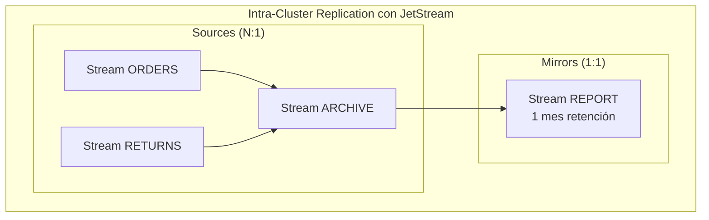

**Fuentes (Sources)**:
- Un stream de JetStream puede configurarse para **obtener datos de múltiples streams** de origen
- Permite patrón de **agregación (N:1)**
- **Ejemplo**: Stream ARCHIVE obtiene datos de ORDERS y RETURNS (retención corta)
- ARCHIVE persiste a largo plazo

**Espejos (Mirrors)**:
- Un stream puede configurarse como **espejo de otro stream**
- **Copia 1:1** del stream de origen
- **Ejemplo**: Stream REPORT (1 mes retención) refleja ARCHIVE (1 año retención)
- Útil para crear **vistas filtradas** o con diferentes políticas de retención

#### Patrón 2: Replicación Inter-Región

**Propagación de Eventos Globales**

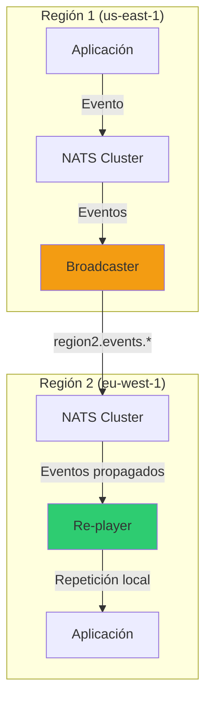

**Componentes**:
1. **NATS Gateways**: Conectan clústeres de diferentes regiones
2. **Bridge**: Servicio que recibe acción original, la convierte en evento, publica en clúster local
3. **Broadcaster**: Servicio especializado suscrito a eventos locales
   - Lee metadatos del evento
   - Determina a qué otras regiones necesita propagarse
   - Publica en temas específicos de región (ej. `region2.events.user.created`)
4. **Re-player**: Servicio suscrito a temas de región propagados
   - Recibe evento vía NATS Gateway
   - "Reproduce" localmente (llamada HTTP, escritura en BBDD)

### Conclusión del Dominio 4

**Veredicto**: ❌ **No Suplantado** (requiere tecnología externa)

**Keycloak NO proporciona** esta capacidad.

**Recomendación**: **NATS con JetStream** emerge como solución moderna, ligera y de alto rendimiento:
- ✅ **Alternativa más simple** que Apache Kafka para comunicación entre servicios
- ✅ **Patrones arquitectónicos nativos** (Mirrors/Sources)
- ✅ **Patrones de diseño establecidos** (Broadcaster/Re-player)
- ✅ **Implementación "lista para usar"** de este contexto

---

## Dominio 5: El Contexto Delimitado de Auditoría y Eventos de Seguridad

### Análisis del Dominio

Este contexto es **la base de la observabilidad, el cumplimiento normativo (compliance) y la respuesta a incidentes de seguridad**.

> **¿Qué ha sucedido en el sistema, quién lo hizo y cuándo?**

**Responsabilidades**:
- Capturar de manera **fiable** todos los eventos significativos
- Capturar eventos de **seguridad y administrativos**
- Enviar a sistemas externos para **almacenamiento, análisis y alerta**

### Keycloak como Fuente de Eventos (Solución Parcial)

Keycloak suple una **parte crítica** de este contexto: **la generación de eventos** en el punto de origen (el IdP).

#### Dos Flujos de Eventos Distintos

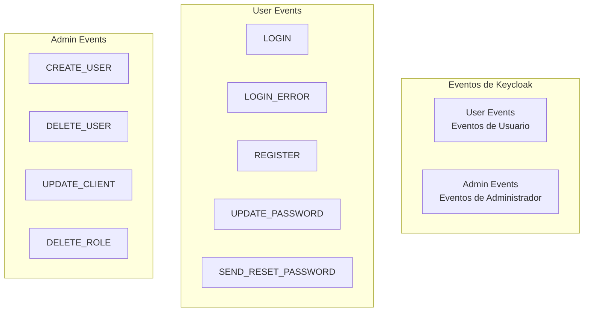

#### 1. Eventos de Usuario (User Events)

**Definición**: Acciones realizadas **por o para** un usuario final

**Ejemplos**:
- `LOGIN`
- `LOGIN_ERROR`
- `REGISTER`
- `UPDATE_PASSWORD`
- `SEND_RESET_PASSWORD`

**Configuración**: Events → User events settings

#### 2. Eventos de Administrador (Admin Events)

**Definición**: Acciones realizadas **por un administrador** vía Consola de Administración o API de Administración

**Ejemplos**:
- `CREATE_USER`
- `DELETE_USER`
- `UPDATE_CLIENT`
- `DELETE_ROLE`

**Configuración**: Events → Admin events settings

#### Limitaciones de Almacenamiento

**Opciones disponibles**:
- ✅ **Almacenar en BBDD de Keycloak**: Útil para depuración
- ⚠️ **Advertencia explícita**: **NO recomendado para producción**
- ❌ **Razón**: El volumen de eventos (especialmente LOGIN) puede **degradar rápidamente el rendimiento** de la BBDD
- ❌ **Impacto**: Afecta los flujos de autenticación

**Solución por defecto**: `jboss-logging`
- Simplemente escribe eventos en los **logs del servidor**
- No útil para análisis ni compliance

### La Costura Arquitectónica: El SPI de Event Listener

Esta **aparente brecha** no es un descuido, sino una **decisión de diseño deliberada**.

Keycloak fue diseñado explícitamente para que este contexto fuera **extensible**.

**La solución "lista para usar"** para auditoría de producción **NO es** el almacenamiento en BBDD, sino la **implementación de un Service Provider Interface (SPI)**, específicamente el **Event Listener SPI**.

#### Service Provider Interface (SPI)

**Propósito**: Actúa como una **"costura" arquitectónica**, un gancho de código diseñado que permite interceptar cada evento en tiempo real y enviarlo a **cualquier sistema externo** deseado.

**Componentes del patrón**:

```mermaid
graph TB
    subgraph "Event Listener SPI Implementation"
        SF[Service File<br/>META-INF/services/]
        FACTORY[EventListenerProviderFactory<br/>create()<br/>getId()]
        PROVIDER[EventListenerProvider<br/>onEvent()<br/>onEvent(AdminEvent)]
        EXT[Sistema Externo<br/>NATS/SIEM/Logging]
    end
    
    SF --> FACTORY
    FACTORY --> PROVIDER
    PROVIDER --> EXT
```

#### Implementación del EventListenerProvider

**Paso 1: Service File**
```
# src/main/resources/META-INF/services/
org.keycloak.events.EventListenerProviderFactory
com.example.SampleEventListenerProviderFactory
```

**Paso 2: EventListenerProviderFactory**

```java
public class SampleEventListenerProviderFactory implements EventListenerProviderFactory {
    @Override
    public EventListenerProvider create(KeycloakSession session) {
        return new SampleEventListenerProvider();
    }
    
    @Override
    public String getId() {
        return "sample_event_listener";
    }
}
```

**Paso 3: EventListenerProvider**

```java
public class SampleEventListenerProvider implements EventListenerProvider {
    @Override
    public void onEvent(Event event) {
        // Filtrar solo eventos de LOGIN exitosos
        if(event.getType().toString().equals("LOGIN")) { 
            // En lugar de System.out.println:
            // Aquí es donde se envía al bus de mensajería
            publishToNATS(event);
        }
    }
    
    @Override
    public void onEvent(AdminEvent adminEvent, boolean includeRepresentation) {
        // Manejar eventos de administrador
        publishToNATS(adminEvent);
    }
    
    private void publishToNATS(Object event) {
        // Implementación con cliente NATS
        // Publicar en stream de JetStream
    }
}
```

### Componiendo Contextos: La Arquitectura Híbrida

Aquí es donde los **dominios se conectan** para formar una arquitectura completa y robusta:

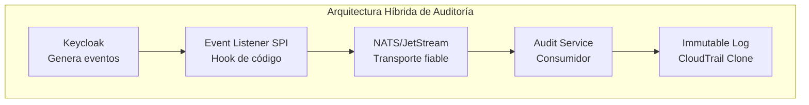

**Composición de plataformas**:
1. **Dominio 5** (Auditoría) requiere que eventos de seguridad sean capturados y enviados a sistema externo
2. **Keycloak** (Dominio 1) **genera** estos eventos
3. **EventListenerProvider** (SPI) proporciona el **gancho exacto** para interceptar eventos en tiempo real
4. **NATS** (Dominio 4) suple el **transporte fiable y asíncrono**

**Flujo completo**:
- Desarrollador implementa **EventListenerProvider personalizado**
- Dentro de `onEvent()` y `onEvent(AdminEvent)`, en lugar de `System.out.println`
- **Instancia cliente NATS**
- **Publica evento** (serializado como JSON) en streams dedicados de JetStream
- **Temas**: `keycloak.events.user` y `keycloak.events.admin`

**Resultado**: Keycloak suple el **"qué"** (contenido semántico del evento), el SPI proporciona el **"dónde"** (gancho de código), y NATS suple el **"cómo"** (transporte fiable y asíncrono).

### Conclusión del Dominio 5

**Veredicto**: ✅ **Suplantado mediante Composición**

**Keycloak suple la parte más difícil**: la **generación de eventos semánticos de seguridad**

**Proporciona la "costura" de código perfecta**: el **Event Listener SPI** para conectar estos eventos

**La solución completa es una composición de plataformas**:
- ✅ **Keycloak** (Dominio 1): Fuente de eventos
- ✅ **NATS** (Dominio 4): Transporte
- ✅ **EventListenerProvider**: Puente entre plataformas

Esta arquitectura **modular y desacoplada** es superior a una solución monolítica.

---

## Dominio 6: El Contexto Operativo (Arquitectura de la Plataforma de Identidad)

### Análisis del Dominio

Este es el **"meta-contexto"** que a menudo se pasa por alto.

> **¿Cómo operamos, escalamos y mantenemos fiables las plataformas (como Keycloak) que suplantan a los otros contextos?**

**La adopción de una plataforma COTS o de código abierto como Keycloak NO elimina el esfuerzo de ingeniería; lo transforma**.

**Transformación**:
- **Antes**: Esfuerzo de desarrollo (Construir el Dominio 1)
- **Después**: Esfuerzo operativo (Operar el Dominio 6)

**Este contexto representa**: El **Coste Total de Propiedad (TCO)** y los requisitos no funcionales de la plataforma de identidad.

### Requisitos de Producción

Una implementación de Keycloak en producción tiene **requisitos no negociables**:

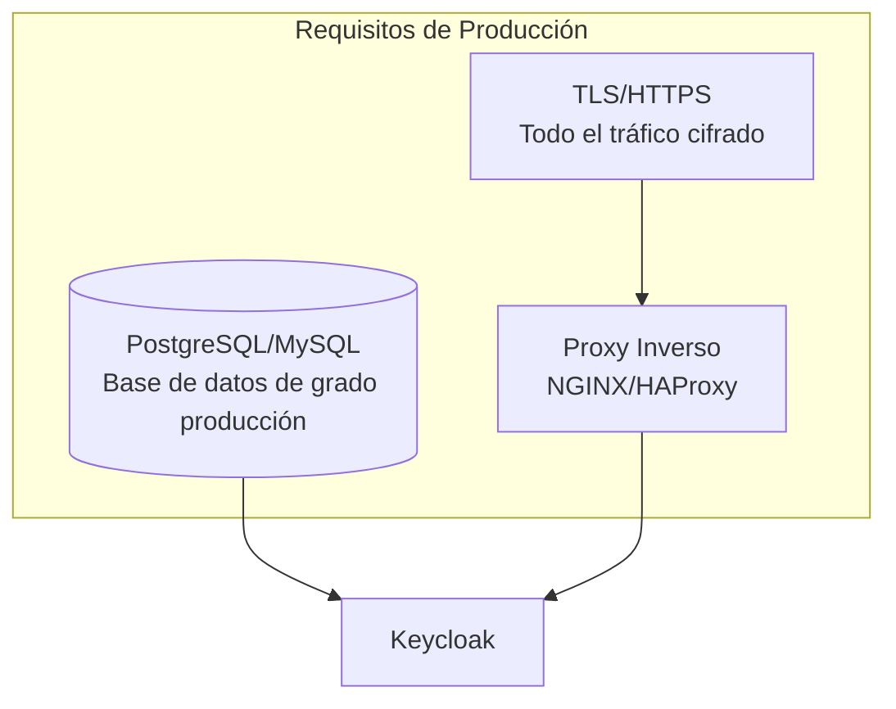

#### 1. Base de Datos de Grado de Producción

- **Keycloak almacena**: Usuarios, realms, clientes, roles
- **BBDD de desarrollo**: H2 en memoria (**NO compatible** con producción)
- **Requerido**: BBDD externa robusta (PostgreSQL, MySQL, etc.)

#### 2. TLS/HTTPS

- **Todo el tráfico** hacia Keycloak debe estar **cifrado**
- **Proxy inverso** maneja certificados TLS

#### 3. Proxy Inverso

- **NGINX** o **HAProxy**
- Gestiona TLS
- Punto de entrada
- Balanceo de carga

### Arquitectura de Alta Disponibilidad (HA)

Keycloak está diseñado para ejecutarse en un **clúster de múltiples nodos** para lograr HA.

#### Arquitecturas HA Soportadas

##### 1. Clúster Único (Single-Cluster)

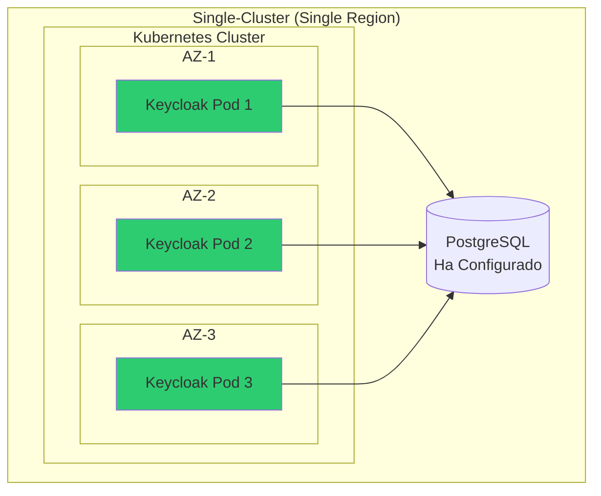

**Características**:
- Todos los nodos en **un solo clúster** (ej. Kubernetes)
- Clúster distribuido en **múltiples AZ** para resiliencia

##### 2. Multi-Clúster (Multi-Region)

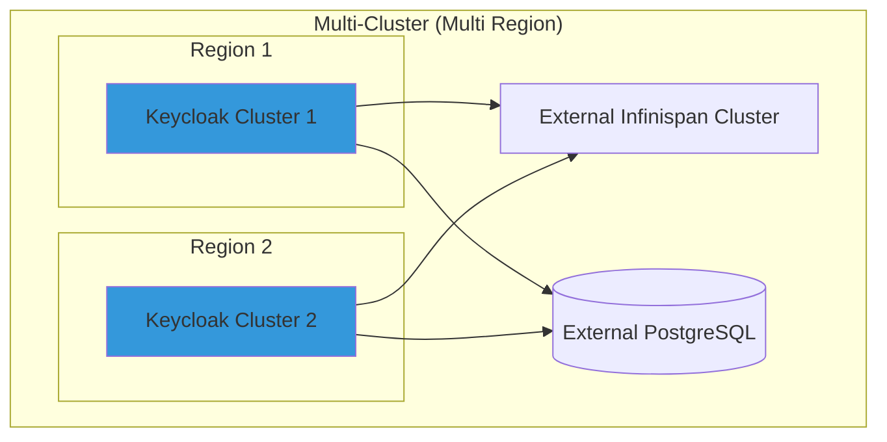

**Características**:
- Despliegues **independientes** (diferentes regiones/centros de datos)
- Se conectan entre sí
- **Tolerancia a fallos a nivel de región**
- **Complejidad operativa significativa**
- Requiere balanceador externo
- A menudo requiere **clúster Infinispan externo**

### El Corazón de Keycloak: Caching Distribuido (Infinispan)

El componente **más crítico** para el rendimiento y estabilidad de un clúster Keycloak es su **capa de caché distribuida**.

Keycloak utiliza **Infinispan**, una **cuadrícula de datos en memoria** (in-memory data grid), para gestionar el estado compartido entre nodos del clúster.

#### Tipos de Cachés

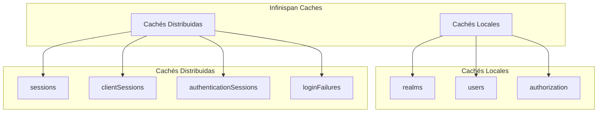

**1. Cachés Locales** (realms, users, authorization):
- **Almacenan**: Datos persistentes leídos de la BBDD
- **Optimización**: Evitan costosos viajes a la BBDD en cada solicitud
- **Invalidación**: Se propaga a través del clúster cuando un objeto cambia
- **Cada nodo** mantiene su propia caché local

**2. Cachés Distribuidas** (sessions, clientSessions, authenticationSessions, loginFailures):
- **Almacenan**: Datos volátiles que deben ser **compartidos y accesibles por todos los nodos**
- **Ejemplo**: Sesión de usuario almacenada en caché distribuida `sessions`
- **Beneficio**: Permite balanceador enviar solicitudes sucesivas a **diferentes nodos** sin interrumpir la sesión

**Descubrimiento de Nodos**: **jdbc-ping**
- Cada nodo escribe su presencia en tabla compartida (JGROUSPING) en la BBDD principal
- Lee esa tabla para descubrir a sus pares

### El Modelo de "Control Plane" vs. "Data Plane"

A medida que una implementación Keycloak **escala**, es beneficioso analizarla (y operarla) utilizando el paradigma de **Plano de Control** y **Plano de Datos**.

```mermaid
graph TB
    subgraph "Plano de Control (Control Plane)"
        ADMIN[Consola de Administración]
        ADMIN_API[API de Administración]
        DB[(Base de Datos Persistente)]
    end
    
    subgraph "Plano de Datos (Data Plane)"
        AUTH[/auth Endpoint]
        TOKEN[/token Endpoint]
        USERINFO[/userinfo Endpoint]
        LOGIN[Login Pages]
    end
    
    ADMIN --> DB
    ADMIN_API --> DB
    AUTH --> TOKEN
    TOKEN --> USERINFO
    LOGIN --> AUTH
```

#### Plano de Control (Control Plane)

**Comprende**: Operaciones de **configuración y gestión**

**En Keycloak**:
- Consola de Administración
- API de Administración
- Base de datos persistente

**Características**:
- **Sensible a la consistencia** y control de acceso
- **No es de latencia crítica**
- Tráfico **relativamente bajo**
- Aquí se **crean realms**, **configuran clientes**, **definen roles**, **escriben políticas**

#### Plano de Datos (Data Plane)

**Comprende**: Operaciones de **ejecución de políticas en tiempo real**

**En Keycloak**:
- Endpoints de alto tráfico: `/auth`, `/token`, `/userinfo`
- Páginas de inicio de sesión

**Características**:
- **Altamente sensible a latencia y disponibilidad**
- Debe **escalar horizontalmente** para manejar picos de carga de inicio de sesión
- **Tráfico alto**

#### Arquitectura Operativa Avanzada

**Despliegue híbrido**:

```mermaid
graph TB
    subgraph "Despliegue Híbrido"
        subgraph "Control Plane (Dedicado)"
            CP[Keycloak Instancia<br/>Larga duración]
        end
        
        subgraph "Data Plane (Autoescalable)"
            DP1[Keycloak Pod 1<br/>Ephemeral]
            DP2[Keycloak Pod 2<br/>Ephemeral]
            DP3[Keycloak Pod N<br/>Ephemeral]
        end
        
        SHARED[(BBDD Central<br/>+ Infinispan<br/>Compartidos)]
    end
    
    CP --> SHARED
    DP1 --> SHARED
    DP2 --> SHARED
    DP3 --> SHARED
    
    style CP fill:#e74c3c
    style DP1 fill:#2ecc71
    style DP2 fill:#2ecc71
    style DP3 fill:#2ecc71
```

**Ejemplos**:
- Instancia **dedicada y de larga duración** sirve como Plano de Control administrativo
- Conjunto de instancias **efímeras y autoescalables** (Google Cloud Run, AWS Fargate) maneja tráfico del Plano de Datos
- Todas conectadas a la **misma BBDD central y clúster de Infinispan**

### Estrategias de Escalado y Rendimiento

La operación a escala requiere un **ajuste cuidadoso**:

#### Escalado

**1. Escalado Vertical**:
- Ajustar recursos de la **JVM** (memoria y CPU)
- Para un nodo individual

**2. Escalado Horizontal**:
- Añadir más **nodos** (pods de Kubernetes) al clúster
- Para distribuir la carga

#### Puntos de Referencia de Rendimiento

**Guía de dimensionamiento**:

| Métrica | vCPU por 1 vCPU |
|---------|-----------------|
| **Inicios de sesión usuario/seg** | 15 |
| **Concesiones de credenciales cliente/seg** | 120 |
| **Refrescos de token/seg** | 120 |

**Problemas de rendimiento**:
- **CPU throttling** degrada significativamente el rendimiento
- **Crítico**: Proporcionar a los nodos los recursos de CPU que solicitan
- **A escala >1M usuarios**: Cuellos de botella se desplazan a:
  - BBDD (búsquedas LIKE en `user_entity`, contención en tablas)
  - Tamaño del token (usuarios con cientos de roles)

### Conclusión del Dominio 6

**Veredicto**: ❌ **No Suplantado** (Es el Coste de Propiedad)

**Este contexto NO puede ser suplantado por una tecnología**; es el **coste de suplantar a los demás**.

**La adopción de Keycloak es una decisión estratégica** para operar una plataforma de IAM de misión crítica:

**Reemplaza**:
- ✅ Complejo desarrollo de software (Dominio 1)

**Por**:
- ✅ Compleja ingeniería de operaciones (Dominio 6)

**Demanda experiencia en**:
- ✅ Gestión de clústeres de **aplicaciones Java (JVM)**
- ✅ **Redes** y balanceadores de carga
- ✅ **Bases de datos relacionales** de alto rendimiento
- ✅ **Cachés distribuidas en memoria** (Infinispan)

**Representa el TCO (Total Cost of Ownership)** de adoptar Keycloak como plataforma IAM.

---

## Conclusiones y Recomendaciones Arquitectónicas

### Síntesis de los Hallazgos

Este análisis ha diseccionado **seis Contextos Delimitados fundamentales**, evaluando cómo Keycloak y tecnologías nativas de la nube pueden suplantarlos.

#### Matriz de Suplantación

| Dominio | Veredicto | Estado | Tecnología Recomendada |
|---------|-----------|--------|------------------------|
| **1. Identidad y Autenticación** | ✅ **Totalmente Suplantado** | Keycloak nativo | Keycloak |
| **2. Autorización de Grano Fino** | ⚠️ **Parcialmente Suplantado** | Keycloak + PDP externo | **Cedar/AVP** |
| **3. Delegación Segura** | ✅ **Totalmente Suplantado** | Keycloak nativo | Keycloak (RFC 8693) |
| **4. Replicación Asíncrona** | ❌ **No Suplantado** | Externa | **NATS/JetStream** |
| **5. Auditoría y Eventos** | ✅ **Suplantado mediante Composición** | Keycloak + NATS | Event Listener SPI + NATS |
| **6. Contexto Operativo** | ❌ **No Suplantado** | Es el Coste | Kubernetes + SRE |

### Recomendación de Arquitectura Híbrida

Basándose en este análisis exhaustivo, **la arquitectura de referencia recomendada** NO es una solución monolítica, sino una **arquitectura híbrida** compuesta por las mejores herramientas para cada dominio:

```mermaid
graph TB
    subgraph "Arquitectura Híbrida Recomendada"
        subgraph "Identidad y Delegación"
            KC[Keycloak<br/>SSO + Token Exchange]
        end
        
        subgraph "Autorización"
            CEDAR[Cedar/AVP<br/>Motor de Políticas]
            PEP[PEP<br/>Puntos de Coerción]
        end
        
        subgraph "Mensajería"
            NATS[NATS/JetStream<br/>Event Bus]
        end
        
        subgraph "Auditoría"
            SPI[Event Listener SPI<br/>Custom]
            AUDIT[Audit Service]
        end
        
        subgraph "Orquestación"
            K8S[Kubernetes<br/>Plataforma]
        end
    end
    
    KC --> CEDAR
    KC --> NATS
    NATS --> SPI
    SPI --> AUDIT
    PEP --> CEDAR
    PEP --> NATS
    
    KC --> K8S
    NATS --> K8S
    CEDAR --> K8S
    AUDIT --> K8S
    
    style KC fill:#3498db
    style CEDAR fill:#2ecc71
    style NATS fill:#f39c12
    style SPI fill:#9b59b6
    style AUDIT fill:#e67e22
    style K8S fill:#e74c3c
```

#### Componentes de la Arquitectura

**1. Keycloak** (Dominios 1 y 3):
- ✅ **Núcleo central** para Identidad y Autenticación
- ✅ **Delegación Segura** (Token Exchange RFC 8693)
- Gestiona ciclo de vida del usuario, ejecuta SSO, emite tokens

**2. Cedar/AVP** (Dominio 2):
- ✅ **Externalizar** Autorización de Grano Fino a PDP desacoplado
- Servicios de aplicación (PEP) reciben JWT de Keycloak
- Consultan motor Cedar (servicio gestionado AVP o biblioteca integrada) con JWT y contexto de solicitud
- Obtienen **decisiones allow/deny** verificables

**3. NATS/JetStream** (Dominio 4):
- ✅ **Columna vertebral de mensajería** para Replicación Asíncrona de Estado
- Entre todos los microservicios
- Latencia ultrabaja, simplicidad operativa

**4. Custom Event SPI** (Dominio 5):
- ✅ **Desarrollar EventListenerProvider** personalizado y ligero
- Actúa como **puente crítico** entre plataformas
- **Única responsabilidad**: Capturar todos los Eventos de Usuario y Administrador de Keycloak
- **Publicar asíncronamente** en streams dedicados de NATS/JetStream

**5. Kubernetes** (Dominio 6):
- ✅ **Plataforma de orquestación** de contenedores
- Gestiona la carga operativa de despliegues en clúster
- Keycloak, NATS y microservicios de aplicación

### Beneficios de la Arquitectura Híbrida

Esta arquitectura híbrida **aprovecha las fortalezas de cada plataforma**:

- ✅ **Keycloak**: Para lo que es mejor (**Identidad y Estándares**)
- ✅ **Cedar**: Para lo que es mejor (**Autorización Verificable**)
- ✅ **NATS**: Para lo que es mejor (**Mensajería Rápida y Fiable**)

**Resultado**: Un sistema compuesto que es **más seguro, escalable y mantenible** que cualquier solución monolítica única.

### Trade-offs y Consideraciones

#### Ventajas

- ✅ **Seguridad**: Verificación formal (Cedar), estándares probados (OIDC/SAML)
- ✅ **Rendimiento**: Latencia ultrabaja (NATS), caché distribuida (Keycloak/Infinispan)
- ✅ **Escalabilidad**: Arquitectura distribuida probada
- ✅ **Mantenibilidad**: Componentes desacoplados, responsabilidades claras
- ✅ **Flexibilidad**: Cada dominio puede evolucionar independientemente

#### Desafíos Operativos

- ⚠️ **Complejidad**: Múltiples plataformas para operar
- ⚠️ **TCO**: Coste de operar múltiples sistemas
- ⚠️ **Expertise**: Requiere experiencia en cada tecnología
- ⚠️ **Observabilidad**: Debe instrumentar múltiples sistemas
- ⚠️ **Networking**: Latencia entre servicios (Keycloak ↔ Cedar ↔ NATS)

### Cuándo Adoptar Esta Arquitectura

**Recomendado para**:
- ✅ **Organizaciones medianas/grandes** con requisitos de seguridad estrictos
- ✅ **Arquitecturas de microservicios** distribuidas
- ✅ **Requisitos de compliance** (SOX, PCI-DSS, HIPAA)
- ✅ **Escalabilidad** >100K usuarios
- ✅ **Equipos con experiencia** en cloud native

**No recomendado para**:
- ❌ **Aplicaciones simples** con <10K usuarios
- ❌ **Equipos pequeños** sin experiencia en cloud native
- ❌ **Startups** enfocadas en MVP (Minimal Viable Product)
- ❌ **Presupuestos limitados** para operaciones

### Alternativa: Solo Keycloak

Para organizaciones que buscan **simplicidad** sobre **optimización**:

```mermaid
graph TB
    subgraph "Arquitectura Simplificada (Solo Keycloak)"
        KC[Keycloak<br/>+ Authorization Services]
        APP[Aplicación]
    end
    
    KC --> APP
    APP --> KC
```

**Cumple**:
- ✅ **Identidad y Autenticación** (Dominio 1)
- ✅ **Autorización básica** (Dominio 2) - a nivel API
- ✅ **Delegación** (Dominio 3)

**Adecuado para**:
- Aplicaciones con **<100K usuarios**
- **Autorización simple** a nivel de API
- **Equipos pequeños** con recursos limitados
- **Time-to-market** prioritario

### Conclusión Final

La **arquitectura híbrida** no es una moda tecnológica; es una **respuesta pragmática** a la realidad de que **diferentes dominios requieren diferentes soluciones**.

**La clave del éxito** está en:
1. **Entender** las fortalezas y limitaciones de cada tecnología
2. **Diseñar** interfaces claras entre componentes
3. **Operar** con disciplina y observabilidad
4. **Evolucionar** la arquitectura según crece la organización

**El futuro** de la arquitectura de sistemas no está en buscar la **"bala de plata"**, sino en **componer** las herramientas adecuadas para cada trabajo, entendiendo que **la simplicidad emerge de la claridad de responsabilidades**, no de la homogeneidad tecnológica.

---

## Referencias

1. Authorization Services Guide - Keycloak
2. Server Administration Guide - Keycloak
3. Keycloak: A Complete Solution for Identity and Access Management | by Erick Zanetti
4. Keycloak
5. Chapter 7. Assigning permissions using roles and groups | Server Administration Guide | Red Hat build of Keycloak
6. MFA Authentication with Keycloak - Cloud-IAM
7. Chapter 8. Configuring authentication | Server Administration Guide
8. Release Notes - Keycloak
9. Chapter 12. Identity Brokering | Server Administration Guide
10. Documentation - Keycloak
11. Authorization Services Guide | Red Hat build of Keycloak
12. Chapter 4. Managing resources and scopes | Authorization Services Guide
13. Resources, scopes, permissions and policies in Keycloak - Stack Overflow
14. Red Hat build of Keycloak 26.4 Authorization Services Guide
15. Chapter 1. Authorization services overview - Red Hat Documentation
16. Chapter 1. Authorization services overview - Red Hat Documentation
17. Chapter 5. Managing policies | Authorization Services Guide
18. Policy Evaluation API | keycloak-documentation
19. The Complete Guide to Keycloak: Authentication & Authorization - open200
20. Chapter 8. Authorization services | Authorization Services Guide
21. Using Keycloak for fine grained authorization? : r/softwarearchitecture - Reddit
22. Best Practices for Implementing Permissions in Keycloak - Permit.io
23. oauth 2.0 - Guidance about when to use UMA in Keycloak - Stack Overflow
24. Barnett-2025-Modeling the AWS Authorization Engine-vor.pdf
25. Implementing a PDP by using OPA - AWS Prescriptive Guidance
26. OPA vs Cedar (Cedar Agent and OPAL) - Styra
27. Policy Engines: Open Policy Agent vs AWS Cedar vs Google Zanzibar - Permit.io
28. Policy as Code: OPA's Rego vs. Cedar - Permit.io
29. Security Benchmarking Authorization Policy Engines: Rego, Cedar, OpenFGA & Teleport ACD
30. Implementing Policies with OPA — Example Use Cases | by Chathura Gunasekara
31. Rego overview - AWS Prescriptive Guidance
32. Access Control Systems - Open Policy Agent
33. Comparing OPA/Rego to AWS Cedar and Google Zanzibar - Styra
34. MCP Access Control: OPA vs Cedar — The Definitive Guide - Natoma
35. Open Policy Agent (OPA) — A Comprehensive Guide for Cloud and Kubernetes Security
36. Migrating from Open Policy Agent to Amazon Verified Permissions
37. Token-Exchange Use-cases · keycloak keycloak · Discussion
38. Configuring and using token exchange - Keycloak
39. RFC 8693 - OAuth 2.0 Token Exchange - IETF Datatracker
40. OAuth 2.0 - Token Exchange - YouTube
41. Securing OAuth 2.0 Token Exchange Flow with Keycloak | by Gorbaty Sergey
42. What's the Difference Between Assigning Policies to Users vs. IAM Roles in AWS? - Reddit
43. Use temporary credentials with AWS resources - AWS Identity and Access Management
44. Request temporary security credentials - AWS Identity and Access Management
45. For temporary cloud credentials, is there any advantage to using Hashi Vault for secrets... : r/Terraform - Reddit
46. Amazon WorkSpaces SAML 2.0 Federation with Keycloak
47. sts:AssumeRoleWithWebIdentity and keycloak oidc trust policy to filter by role access
48. Comparing NATS and Kafka: Understanding the Differences | by Superstream
49. Cloud Native Kafka Alternatives: Apache Kafka vs. NATS - GitHub
50. Apache Kafka vs. NATS: Differences & Comparison - AutoMQ
51. NATS and Kafka Compared | Synadia
52. NATS vs Kafka Messaging Systems - Wallarm
53. Kafka vs NATS: A Comparison for Message Processing - DZone
54. Data Replication | NATS Docs
55. Cross region, high-performing microservices architecture using NATS
56. Chapter 14. Configuring auditing to track events | Server Administration Guide
57. User Events in Keycloak: Best Practices, Management, and Purging - Phase Two
58. Chapter 15. Auditing and Events | Server Administration Guide
59. Auditing in Keycloak: How to Catch Them All - Skycloak
60. Auditing and Events | keycloak-documentation
61. Server Developer Guide - Keycloak
62. Implementing Keycloak Event Listener SPI (Service Provider Interfaces)
63. Configuring Keycloak for production
64. High availability in Keycloak 24
65. High availability overview - Keycloak
66. Scaling guide feedback · keycloak keycloak · Discussion
67. High Availability Guide | Red Hat build of Keycloak
68. Configuring distributed caches - Keycloak
69. Chapter 10. Configuring distributed caches | Server Configuration Guide
70. Keycloak HA: distributed cache check - infinispan - Stack Overflow
71. Architecture - WSO2 API Manager Documentation
72. Architecture Insights - Cloud-IAM
73. Keycloak Dual Deployment Strategy: Combining Open Source and Serverless for Enterprise Identity
74. Concepts for sizing CPU and memory resources - Keycloak
75. Scaling Keycloak Beyond 1M Users — Search, API Limits, and HA Deployment Lessons?
76. Scaling - Keycloak
